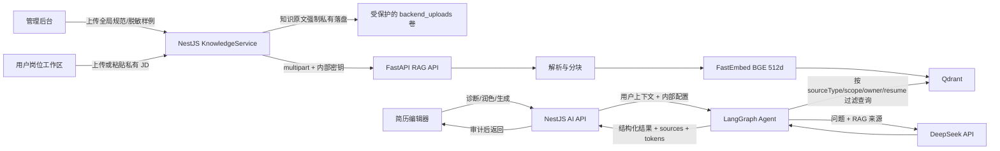

# ResumeSystem 真实 RAG 工程说明

版本：2026-07-13（v1.3 安全与知识分层实现版）
状态：v1.3 代码与本地自动门禁已完成；真实生产环境的 BGE/Qdrant/DeepSeek、租户隔离和密钥迁移验收通过后才可宣称生产 RAG 可用

## 0. 本轮架构决策与现状审计

### 0.1 不在“优秀简历”与“规范 JD”之间二选一

ResumeSystem 将知识分成三层，并为每层设置不同的事实权限、数据范围和生命周期：

| 知识层 | 推荐内容 | 数据范围 | 允许影响 | 禁止事项 |
|---|---|---|---|---|
| 全局规范库 | 简历写作规范、ATS 规则、岗位能力框架、行业术语表 | 全局，只允许管理员维护 | 诊断标准、结构、表达原则、岗位能力映射 | 不得提供候选人的个人事实 |
| 脱敏样例库 | 获得授权且完成脱敏的优秀简历片段 | 全局，按岗位/级别分类 | 结构和表达范式；只能作为 style/example 来源 | 不得复制姓名、公司、项目、数字、时间和成果到用户简历 |
| 用户 JD 工作区 | 用户当前投递岗位的原始 JD、公司补充要求 | 私有，仅 owner user/resume 可访问，支持过期清理 | 岗位任务、技能、关键词和优先级 | 不得进入全局库，不得被其他用户检索 |

因此，默认建设顺序是：**全局规范库 -> 私有 JD 工作区 -> 少量合规脱敏样例库**。不建议把网络收集的原始优秀简历或原始招聘 JD 批量导入全局库；这会同时引入隐私、版权、事实串用和检索污染问题。

### 0.2 事实边界

Agent 可使用全局规范和样例回答“应该怎样写”，可使用当前用户 JD 回答“目标岗位重视什么”，但候选人的公司、学校、职责、时间和数字只能来自当前用户简历或用户本次明确输入。样例命中必须标记为 `example`，JD 命中必须标记为 `job_context`，二者都不能升级为 `candidate_fact`。

### 0.3 v1.3 元数据与检索路由

每个 chunk 至少携带以下字段：

```text
sourceType: standard | role-framework | resume-exemplar | job-description
scope: global | private
ownerUserId: private scope 必填
resumeId: job-description 建议必填
category: 岗位/行业分类
licensed: resume-exemplar 必须为 true
piiReviewed: resume-exemplar 必须为 true
enabled: 是否参与检索
expiresAt: private JD 可选的自动清理时间
```

检索路由：

- `diagnose`：全局规范 + 岗位能力框架 + 当前用户/简历 JD。
- `polish`：全局规范 + 当前用户 JD；只有用户主动选择“参考表达”时才检索脱敏样例。
- `generate`：同上，但生成事实仍只能来自用户内容；样例只提供结构，必须执行数字和命名实体校验。
- 所有 private filter 必须在 Qdrant 查询阶段生效，禁止先全库召回再在应用层过滤。

### 0.4 2026-07-13 审计问题与实现状态

| 审计问题 | v1.3 处理 | 发布验收 |
|---|---|---|
| 全局知识文档被停用，strict RAG 无来源 | 线上已恢复 `ready + enabled`；新 Agent 部署后必须按新元数据重建索引 | 真实 Hybrid 检索和 live diagnose 返回来源 |
| `/uploads/knowledge` 可匿名下载 | NestJS 静态中间件和 Nginx 双层返回 404；原文件只允许管理员鉴权下载 | 匿名 URL 与跨角色访问测试 |
| LLM/SMTP 密钥明文落库 | 使用独立 `SYSTEM_CONFIG_MASTER_KEY` 做 AES-256-GCM 认证加密；读取接口只返回 configured 标记 | 迁移旧配置后检查数据库无可用明文 |
| 审计日志脱敏不完整 | 对 apiKey、smtpPass、authorization、token、secret 等大小写/命名变体统一遮罩 | 审计回归测试 |
| 重建前先删旧 points | Agent 先解析、切块、Embedding 和构造新 points；写入/清理失败时恢复旧 points | 故障注入测试和旧来源可检索断言 |
| 私有 JD 缺少数据边界 | 新增 owner + resume 专属 JD API，Qdrant Dense/BM25 两路均在查询阶段过滤 | 用户 A/B、跨简历、匿名和后台全局搜索隔离 |
| 样例可能引入隐私/事实串用 | `resume-exemplar` 强制 `licensed + piiReviewed`，默认不参与 diagnose，只有显式参考表达时参与润色/生成 | 样例门禁与事实校验 |
| 文件入口限制不一致 | 浏览器、Nginx、Multer 统一为 10 MB；增加 PDF/DOCX/TXT/Markdown 内容安全校验 | 超限、伪类型、宏、Zip bomb 和路径穿越测试 |

当前索引仍是同步请求，但文档具有 `indexing/ready/failed/disabled` 可观测状态，重建和 JD 替换失败均保留旧的可用来源。异步队列、指数退避和死信处理属于规模化增强项，不作为当前单机 v1.3 的真实性门禁。

### 0.5 v1.3 完成门禁

只有同时满足以下条件，才能标记“真实 RAG 生产可用”：

1. 至少一份全局规范文档为 `ready + enabled`，真实 FastEmbed/Qdrant 检索返回来源。
2. 无来源请求在 strict 模式结构化失败；有来源请求必须返回 live LLM、模型、tokenUsed 和 sources。
3. 私有 JD 无法被其他用户、匿名请求或全局后台搜索越权读取。
4. 样例导入必须通过授权确认、PII 审核和事实隔离测试。
5. `/uploads/knowledge` 匿名访问返回 401/403/404，下载只能走管理员鉴权 API。
6. 数据库和审计日志中不出现可直接使用的 LLM/SMTP 明文密钥。
7. 重建索引失败时旧索引仍可检索；任务可重试且状态可观测。
8. 真实 BGE、真实 Qdrant、真实 DeepSeek 和分类/租户过滤进入发布 E2E，而不只使用 hash/in-memory 测试。

## 1. 目标与边界

本工程把“后台上传标准文档—真实向量化—向量数据库检索—真实 LLM 生成—来源回传”串成一条可审计链路。Embedding 不调用 mock 或哈希近似；LLM 不使用固定模板冒充生成。知识库只为模型提供检索依据，模型不得把知识库中的外部内容当成候选人的个人事实。

当前实现选择：

- Embedding：FastEmbed `BAAI/bge-small-zh-v1.5`，512 维真实稠密向量。
- Vector DB：Qdrant，collection `resume_knowledge_bge_zh_v1_5`。
- Agent：FastAPI + LangGraph，包含感知、检索、分析、规划、生成和校验节点。
- LLM：DeepSeek OpenAI-compatible Chat Completions，模型 `deepseek-v4-pro`。
- 主业务：NestJS 负责鉴权、后台知识库、AI 配置、额度、审计和用户 API。
- 管理端：Vue 后台提供文档上传、重建索引、启停、删除和检索测试。

DeepSeek 官方目前没有公开 Embeddings API，因此本工程没有伪造一个 DeepSeek Embedding 接口，而是使用可在本地真实执行的 BGE 模型。DeepSeek 仅承担生成与推理。

## 2. 运行架构



信任边界：浏览器永远不直接获得 LLM API key 或 Agent 内部密钥；NestJS 与 Agent 之间使用 `X-Agent-Secret`；Agent 仅接受内部鉴权请求；知识库文本在 LLM prompt 中被明确标记为“不可信参考资料”。

## 3. 文档上传与索引流程

全局知识入口为 `POST /api/admin/knowledge-documents/upload`，要求管理员 JWT。私有 JD 使用独立的用户接口与数据模型，不复用全局管理员上传接口。支持 PDF、DOCX、TXT、Markdown；v1.3 将浏览器入口、Nginx、NestJS 和 Agent 的限制统一为 10 MB，并增加 magic bytes、页数/解压上限与解析超时。仅靠扩展名和浏览器 MIME 不构成文件安全校验。

处理顺序：

1. NestJS 保存原文件并创建 `knowledge_documents` 记录，状态设为 `indexing`。
2. `KnowledgeAgentClientService` 通过内部网络把文件、文档 ID、名称和分类发送到 `/rag/index`。
3. Agent 根据类型抽取文本：PDF 使用 PDF 文本解析，DOCX 读取段落，纯文本按 UTF-8 解析。
4. 文本按段落和长度切分为稳定 chunk，每个 chunk 保留 `documentId`、`documentName`、`category` 和 `chunkIndex`。
5. FastEmbed 加载 BGE 中文模型并生成 512 维向量。
6. Agent 检查 Qdrant collection 的向量维度；若旧 collection 维度不同则显式失败，不进行静默混写。
7. Qdrant upsert 完成后返回 chunk 数；NestJS 把记录更新为 `ready`。失败则记录 `failed` 与经过截断的错误信息。

删除、禁用和重建索引均同步操作 Qdrant。重建会先完成解析、Embedding 和新 points 构造，失败时恢复旧 points。私有 JD 替换只有在新索引 ready 后才删除旧版本；删除简历或用户时先清理关联原文和向量，清理失败会阻止业务删除。带 `expiresAt` 的私有资料由后端启动任务和每小时任务清理。知识原文固定保存在受保护的 `backend_uploads` 卷，即使系统启用了公开 R2/OSS 资产桶也不会把知识原文写入公开桶。Embedding 模型文件保存在 Docker 命名卷 `fastembed_models`，容器重建后无需重复下载。

## 4. 检索与 Agent 流程

用户调用 `/api/ai/diagnose`、`/api/ai/polish` 或 `/api/ai/generate` 后：

1. NestJS 校验 cuser JWT、AI 开关和额度。
2. 当 `executionEngine=agent` 时，把用户 ID、活动简历 ID、目标岗位、模块、简历正文与任务要求发送给 Agent；NestJS 先校验简历属于当前用户且未删除。
3. Agent 用目标岗位、模块、正文和用户要求构造检索 query，最大截断到 3000 字符。
4. FastEmbed 对 query 生成同模型向量，在 Qdrant 做 cosine 稠密召回；同时对候选语料执行中英文词法 BM25 召回。
5. 融合重排使用 Dense 0.68、Lexical 0.27、查询词覆盖率 0.05 的默认权重，返回 `denseScore`、`lexicalScore` 和 `retrievalMethod=hybrid-dense-bm25`，便于审计与调参。
6. 岗位诊断把私有 JD 与全局规范分两路检索，私有 JD 不会被全局 top-k 挤出；只要当前 `ownerUserId + resumeId` 没有命中 `factType=job_context` 就显式失败，禁止用全局规范冒充“JD 诊断”。
7. 检索结果以 `sourceType/factType/scope/sourceId/documentId/documentName/category/excerpt/score` 进入 prompt，同时最终响应原样返回 `sources`，支持 UI 引用、事实边界和审计。
8. DeepSeek 以 JSON object response format 返回诊断、策略、建议、patch 和 warnings。
9. Agent 的校验节点检查建议是否引入原简历不存在的数字，并将可疑数字列入 warning。
10. NestJS 只在审计记录中保存必要的输入摘要与输出摘要，不记录 API key。

生产环境默认启用 `RAG_STRICT_SOURCES=true`：Qdrant 不可用或没有达到阈值的来源时，Agent fail-closed 并阻止 LLM 无依据生成。开发环境可关闭该开关，关闭后会在 retrieval step 中显式返回 warning 并继续基础流程。

## 5. LLM 配置

管理员在系统配置中设置：

```text
enabled=true
executionEngine=agent
agentBaseUrl=http://agent:8000
provider=deepseek
apiBaseUrl=https://api.deepseek.com
apiModel=deepseek-v4-pro
temperature=0.3
```

生产环境优先从运行时 secret 注入 API key。若必须通过管理后台更新，落库前使用独立 `SYSTEM_CONFIG_MASTER_KEY` 做 AES-256-GCM 认证加密，数据库只保存 `enc:v1` 密文；主密钥只能存在于服务器 secret，不得与密文同库。后端启动时会自动把旧版明文 `apiKey/smtpPass` 迁移为密文，迁移失败会显式阻止静默丢密钥。API key 不得写入 Git、脚本默认值、Dockerfile、日志或本文档。系统配置读取接口只返回 `apiKeyConfigured`，不会回传明文密钥。NestJS 仅在发起内部 Agent 请求时短暂解密并透传；Agent 不持久化它。审计脱敏覆盖 `apiKey`、`smtpPass`、各类 token/secret/authorization，并使用大小写与命名变体归一化匹配。

Agent 为 DeepSeek V4 请求启用 thinking 与 high reasoning effort，并要求 JSON object。`LLM_TIMEOUT_SECONDS` 默认 120 秒，NestJS 的 `AGENT_REQUEST_TIMEOUT_MS` 默认 150 秒，外层超时必须大于内层，避免 DeepSeek 尚在生成时被主业务提前中止。

知识库索引使用独立的 `KNOWLEDGE_AGENT_REQUEST_TIMEOUT_MS`，生产默认 300 秒，并限制在 120～600 秒之间。原因是 FastEmbed 在新机器、空模型卷或模型版本变更后会先完成模型下载与冷启动；业务后端的索引超时必须覆盖这段时间，不能在 Agent 随后成功写入向量时提前把 MySQL 文档标成失败。模型卷应持久化，发布验收必须包含一次冷启动或空缓存索引；普通搜索不依赖延长 LLM 超时。

## 6. 分页与 PDF 策略

### 6.1 一页适配下限

编辑器的一页适配只调整密度，不删除内容。下限固定为：正文 12px、行高 1.4、模块间距 12px、条目间距 8px。达到下限仍超页时停止压缩，并向用户报告估算页数；不以不可读的小字换取“一页简历”的表面结果。

### 6.2 自然分页

`.resume-section`、`.timeline-section`、`.student-section` 等模块容器允许 `break-inside:auto`。因此一个很长的工作经历模块可以自然进入下一页，不会留下大片空白。

### 6.3 标题孤行

模块标题、条目标题和卡片头使用 `break-after:avoid`，浏览器会尽量把标题与后续内容放在同一页。正文设置 `orphans:2` 与 `widows:2`，降低段首或段尾仅一行落在单独页面的概率。

### 6.4 条目跨页

单个 `.section-item`、时间线卡片、学生模板条目和其他模板的 article 使用 `break-inside:avoid`。分页发生在条目之间，而不是把同一段项目/经历从中间撕开。模块容器与条目采用不同规则，这是自然分页与条目完整性能够同时成立的关键。

### 6.5 PDF 页数断言

Puppeteer 生成 PDF 后，后端用 `pdf-parse` 读取成品并断言 `numpages >= 1`。API 返回：

```json
{
  "url": "/uploads/exports/user-1/resume-xxx.pdf",
  "pageCount": 2
}
```

前端导出完成后显示实际页数。`scripts/pagination-pdf-qa.js` 构造足够长的简历，断言页数至少为 2；`scripts/product-flow-qa.js` 对日常编辑器导出断言页数至少为 1。

## 7. 关键 API

| API | 权限 | 用途 |
|---|---|---|
| `POST /api/admin/knowledge-documents/upload` | admin/operator | 上传并索引文档 |
| `GET /api/admin/knowledge-documents` | admin/operator/viewer | 分页查询文档与索引状态 |
| `POST /api/admin/knowledge-documents/:id/reindex` | admin/operator | 重新解析与向量化 |
| `PUT /api/admin/knowledge-documents/:id/enabled` | admin/operator | 同步启停数据库与向量记录 |
| `DELETE /api/admin/knowledge-documents/:id` | admin/operator | 删除原文件、记录与向量 |
| `POST /api/admin/knowledge-documents/search` | admin/operator/viewer | 只读检索质量测试 |
| `POST /api/resumes/:id/job-description` | cuser owner | 创建/替换当前简历的私有 JD |
| `GET /api/resumes/:id/job-description` | cuser owner | 获取 JD 元数据与解析状态，不返回其他用户数据 |
| `DELETE /api/resumes/:id/job-description` | cuser owner | 删除私有 JD 原文与向量 |
| `POST /api/ai/diagnose` | cuser | RAG 简历诊断 |
| `POST /api/ai/polish` | cuser | RAG 文本润色 |
| `POST /api/ai/generate` | cuser | RAG 内容生成 |
| `POST /api/resumes/export` | cuser | 生成 PDF 并返回真实页数 |

Agent 内部 API：`/rag/index`、`/rag/search`、`/rag/documents/:id`、`/agent/diagnose`、`/agent/polish`、`/agent/generate`；均应只暴露在容器内部网络并要求内部密钥。

## 8. 运行与验证

启动真实 RAG：

```powershell
docker compose -f docker-compose.prod.yml up -d --build backend web admin agent qdrant
# 旧服务器也支持：docker-compose -f docker-compose.prod.yml up -d --build ...
```

首次预热 Embedding：

```powershell
docker exec resume-agent python -c "from app.rag import embed_texts; print(len(embed_texts(['简历知识库'])[0]))"
```

完整 RAG 回归（密钥只在当前进程环境中存在）：

```powershell
$env:QA_ADMIN_USERNAME='<runtime-admin>'
$env:QA_ADMIN_PASSWORD='<runtime-password>'
$env:QA_USERNAME='<runtime-user>'
$env:QA_PASSWORD='<runtime-password>'
$env:QA_LLM_API_KEY='<runtime-test-key>'
node backed-resume/scripts/real-rag-e2e.js
node backed-resume/scripts/private-jd-rag-e2e.js
```

分页 PDF 回归：

```powershell
node backed-resume/scripts/pagination-pdf-qa.js
```

2026-07-11 历史实测：BGE 输出 512 维向量；标准知识库状态 ready、2 chunks；Hybrid 检索 2 hits；DeepSeek live 返回 sources 与 tokenUsed；严格来源无命中请求被结构化阻断。

2026-07-13 发布前代码门禁：NestJS 135 项测试、Agent 15 项测试、三端生产构建和生产依赖审计通过。线上旧文档已恢复为 ready + enabled，但 v1.3 新 payload 过滤器不会读取缺少 `sourceType/scope` 的旧 points，因此部署必须无条件重建全部启用的全局文档，再执行真实 Hybrid、live DeepSeek 和私有 JD 租户 E2E；数据库状态不能替代这一步。

知识文档管理 API 必须把 MySQL `TINYINT` 元数据 `enabled/licensed/piiReviewed` 序列化为 JSON boolean，管理端加载后还要再次归一化。只读打开知识库页面不得产生 `PUT .../enabled` 等写请求；发布浏览器回归需要记录页面加载前后的审计日志和文档 enabled 状态，防止 UI 开关因 `1 !== true` 的类型差异在挂载时静默停用全局 RAG 来源。

## 9. 运维与故障排查

- Agent health 为 degraded：先检查 Qdrant 网络、collection 和内部密钥，不要直接切换 hash。
- 向量维度冲突：修改 Embedding 模型时必须使用新 collection 名或执行明确迁移，禁止在旧 collection 混写。
- 首次索引慢：检查 `fastembed_models` 卷；首次模型下载后应持久化。
- 文档 `failed`：在后台查看 errorMessage，修正文档后点重建索引。
- 检索无命中：分别检查 enabled、category、最低分数阈值、chunk 内容和 query；先调用后台 search API 隔离 LLM 因素。
- LLM 401/402/429：分别检查密钥、余额/权限、速率限制；不得自动回落为 mock 并宣称成功。
- LLM 超时：确保 NestJS 外层超时大于 Agent 内层超时，必要时降低输入长度或模型推理强度。
- PDF 503：确认容器中的 `PUPPETEER_EXECUTABLE_PATH=/usr/bin/chromium-headless-shell` 与镜像安装内容一致。
- PDF 页数异常：保存原始 HTML 与 PDF，检查 `@page`、A4 宽度、字体加载、超长不可拆元素和图片尺寸。
- HTTPS/证书：首次使用 `deploy/bootstrap-tls.sh --confirm` 通过 TLS-ALPN 签发证书；acme.sh 定时续期会短暂停止反向代理释放 443，完成后重启并 reload Nginx。健康检查同时断言证书剩余期、容器直连状态、HTTPS 公共路径和一次真实 RAG 检索。
- 备份/恢复：`deploy/backup.sh` 在归档 Qdrant 卷时只短暂停止 Agent/Qdrant，默认保留最近 7 份；`deploy/restore.sh --confirm <backup>` 会先做强制备份，失败时尝试恢复在线栈。

## 10. 已知限制与下一步

- 当前知识数据量只有一份规范文档和 2 个 chunks，即使重新启用也只能证明链路，不足以证明岗位覆盖和生产检索质量。
- 当前 BM25 在有限 scroll 候选上临时计算，不是全库稀疏索引；知识规模扩大后需使用 Qdrant sparse vector/BM25 索引并执行离线检索评测。
- 当前重排是可解释的轻量融合，没有 Cross-Encoder；是否启用重模型必须以服务器内存、延迟和离线 nDCG/Recall 评测为依据。
- 原始优秀简历不得直接进入生产库；先建立授权、脱敏、PII 复核和样例事实隔离流程。
- 私有 JD 已在向量层强制 owner/resume filter，并具备替换保旧、删除级联与小时级过期清理；多实例并发替换时仍需升级为数据库分布式锁。
- 当前已使用 Dense + BM25 融合和轻量重排；更大规模知识库可继续增加独立稀疏向量索引与 Cross-Encoder reranker。
- 目前 chunk 策略以段落与长度为主，可进一步加入 Markdown 标题层级和表格感知切分。
- 严格来源模式已作为生产默认值；后续可在管理后台增加按任务类型配置。
- DeepSeek V4 的长上下文能力不意味着每次都应发送全部简历与全部知识库；检索仍应控制来源数量和 token 成本。
- PDF CSS 的 `avoid` 是浏览器分页提示；如果单个条目本身高于一整页，浏览器仍必须拆分。UI 应提示用户拆分超长条目。

## 11. 相关文件

- `python-agent/app/rag.py`：解析、切分、Embedding、Qdrant。
- `python-agent/app/graph.py`：Agent 节点与 RAG/LLM 编排。
- `python-agent/app/llm.py`：DeepSeek OpenAI-compatible 调用与结构化输出。
- `backed-resume/modules/knowledge/`：知识库业务与内部 Agent 客户端。
- `backed-resume/modules/ai/ai-agent-client.service.ts`：用户请求到 Agent 的桥接。
- `backed-resume/modules/resumes/resumes.service.ts`：打印 CSS、PDF 生成与页数解析。
- `fronted-resume-web/src/views/CoreResumeEditor.vue`：一页适配下限与导出页数反馈。
- `docs/knowledge-base/resume-writing-standard-v1.md`：本轮上传并验证的标准知识库。
- `backed-resume/scripts/real-rag-e2e.js`：真实 RAG 端到端门禁。
- `backed-resume/scripts/private-jd-rag-e2e.js`：私有 JD、跨租户、真实 job_context 与删除生命周期门禁。
- `backed-resume/scripts/pagination-pdf-qa.js`：多页 PDF 门禁。
