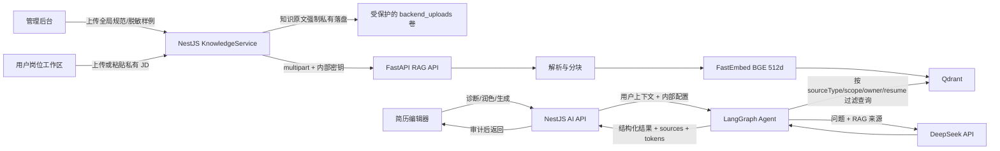

# ResumeSystem 真实 RAG 工程说明

## 2026-07-16 canonical fixture 发布内存约束补充

生产 `resume-agent` 的 cgroup 上限为 512 MiB。Agent lifespan 已在 PID 1 内预热真实 FastEmbed 模型后，canonical fixture 索引必须通过带 `X-Agent-Secret` 的内部 `/rag/index` 复用该进程；禁止再用 `docker exec` 启动第二个会 import `app.rag` 或加载 ONNX 模型的 Python 索引进程。宿主机 `MemAvailable` 和 Swap 门禁不能替代容器 cgroup 门禁：2026-07-16 的首次候选发布中，宿主机资源检查全部通过，但 PID 1 与 CLI 各自持有模型后触及 512 MiB 上限，内核以 memcg OOM 杀死 Uvicorn，发布因此按 fail-closed 流程自动回滚。

发布 fixture 的容器内客户端只能使用 Python 标准库构造内部 HTTP 请求，不得 import FastEmbed、Qdrant client、LangGraph 或 `app.rag`。索引成功必须同时断言 HTTP 200、document id、正 chunk count、`fastembed` backend 与精确模型名；删除补偿同样走内部鉴权 API。脚本的 ERR 补偿只允许在最外层执行一次，禁止让 `errtrace` 把同一个失败传播进 command substitution 后先删 marker、再由父 shell 以“marker 缺失”重复补偿。任一步失败仍须保留或严格提交 marker，并逐项验证 MySQL、uploads 与 Qdrant 清理结果后才能恢复公网。

对应发布回归必须在 512 MiB Agent 限额下启动真实 Uvicorn，等待离线 FastEmbed 预热完成，再依次执行 fixture 索引和 exact-document dense attestation；验收要求索引/探针均为 200、dense cosine 不低于 0.995、容器零重启且 `OOMKilled=false`。仅运行脱离 Uvicorn 的单进程 CLI 索引不能证明这条生产约束。

版本：2026-07-15（v1.3.4 公网入口、单飞冷启动门禁与 RAG 可靠性修复版）
状态：真实 BGE/Qdrant/DeepSeek 核心链路已验证；只有公网浏览器 Origin、响应契约、停用重建和发布 E2E 同时通过后，才可宣称对应入口可用

发布源码归档必须与目标 Git commit 的原始 blob 逐字节一致，不能受构建机 `core.autocrlf` 或平台默认换行符影响。构建器必须以 `core.autocrlf=false`、`core.eol=lf` 生成归档，并逐项比对所有 `runtimeFiles` 的归档 SHA-256 与 Git blob SHA-256；任何会被 shell `source` 的文件只允许 LF，发现 CR 字节必须在镜像切换、维护规则或 rollout marker 写入前 fail-closed。制品清单不得为经过工作树 EOL 转换的字节“自洽背书”。

## v1.3.4 修复基线与发布门禁

本补丁处理“服务内部可调用，但公网浏览器不可用”和“健康或数据库状态与真实向量状态不一致”两类问题。实现与发布必须同时满足以下约束：

1. `get_rag_status()` 只有在真实执行 Qdrant `collection_exists` 请求成功后，才能返回 `qdrant_reachable=true`；构造客户端不代表依赖可达，失败必须保留 `false` 并返回降级状态。
2. 文档重建索引必须继承或显式传递原 `enabled` 状态。停用文档重建成功后仍为停用；停用状态同步失败时必须 fail-closed，清理本次新向量，禁止数据库显示停用但 Qdrant 仍可检索。
3. `failed` 文档不能通过普通启用开关直接变成 `ready`，必须先重新索引成功；禁用失败文档时保留失败原因，便于后台排障。
4. NestJS 必须保留 Agent 的 `strategy`、`warnings`、`suggestions` 和 `sources`。兼容当前 Agent 将策略和警告放在 `planning/validation` step output 的结构；C 端 `generate` 优先消费 Agent `suggestions`，没有时才回退到 direct provider 的 `summary/skills/projects` 契约。
5. CORS 继续使用精确 scheme + host 白名单，禁止通配 Origin。公网 IP 通过 HTTP 提供页面时，生产 `FRONTEND_URL` 必须显式包含 `http://121.43.208.184`；HTTPS IP 是另一个 Origin，不能替代 HTTP IP。发布预检和健康检查统一读取 `.env` 的 `CORS_PROBE_ORIGIN`，禁止各自硬编码不同入口。
6. 发布验收不能只用无 `Origin` 的 curl。必须以 `Origin: http://121.43.208.184` 验证登录预检、真实登录和 AI 请求，并断言未知 Origin 仍为 403。域名尚未通过外部 HTTPS 验收时使用 `REQUIRE_PUBLIC_HTTPS=false` 的 IP-only 门禁；域名可用后必须改为 `true`，恢复证书与 HTTPS 健康检查。
7. RAG 发布烟测必须返回 `execution_mode=live`、真实 provider/model、`token_used > 0` 和非空 `sources`；同时校验 Agent 六节点完成、响应可被 C 端契约消费。
8. Agent 的 HTTP 健康并不代表 FastEmbed 已完成首次 ONNX 模型加载。生产 lifespan 必须在 Uvicorn 接受请求前同步完成真实模型预热；初始化锁只允许单飞，任何意外并发初始化立即 fail-fast，禁止业务线程排队等待。`/rag/index` 的解析、Embedding 和 Qdrant 写入必须放入线程池，不能在 `async` 路由的事件循环中直接运行同步重任务。发布门禁从 MySQL 选择同一条 `ready + enabled + global` 文档，把其 `documentId + chunkCount` 交给内部 `/rag/health-probe`，由 Agent 从该文档的 Qdrant payload 派生查询并断言 Hybrid 检索返回同一文档，禁止再与固定文案或两个互不关联的断言耦合。
9. `index_document`、`set_document_enabled` 和 `delete_document` 必须共享按 `documentId` 的非阻塞变更锁。同一文档已有重建、启停或删除操作时，新操作立即返回 HTTP 409，NestJS 保留该冲突语义交给调用端重试；重建冲突不得被 catch-all 转换为 `failed + HTTP 200`，也不得由失败方覆盖成功方最终状态。禁止排队后产生混合切片、回滚覆盖或删除后向量复活。发布预检必须要求 `RAG_ENABLED=true`，Agent `/health` 必须同时满足 `enabled=true`、`embedding_backend=fastembed`、Qdrant 可达和 collection ready；`/rag/health-probe` 在 RAG 关闭时必须返回 `rag_disabled`，不得绕过开关直接检索形成假阳性。
10. 生产验收必须穿过反向代理并触发应用数据库查询：允许 Origin 的预检同时断言 `Access-Control-Allow-Origin` 与 `Access-Control-Allow-Credentials: true`，未知 Origin 必须返回 403，无效登录必须返回认证失败而不是 5xx。容器 `running/healthy` 不能替代这组验收。
11. 首次真实 RAG 发布不能依赖“用户先上传一份文档”来通过健康门禁。Agent lifespan 必须用真实 FastEmbed 探针向量得到实际维度，并幂等创建 Qdrant collection 与 payload indexes；Qdrant 暂未就绪时最多重试 30 秒，既有 collection 维度不一致时立即失败，不得重试或创建 hash 兼容假集合。
12. 发布在 Agent 与 Backend 健康、但公网仍处于维护态时，通过 `deploy/bootstrap-rag-fixture.sh` 把仓库内 SHA-256 受制品约束的 `docs/knowledge-base/resume-writing-standard-v1.md` 写入 uploads、MySQL 与真实 FastEmbed/Qdrant。已有 release fixture 只有在源文件 SHA-256 一致且 `documentId + chunkCount` 精确检索通过时才复用，禁止覆盖旧文件却保留旧向量。新建前先持久化 `/opt/resumesystem-rag-bootstrap-rollout.env`，任一步失败必须逐项验证并补偿删除该 DB 行、向量和文件；任一补偿失败都保留标记并保持公网关闭。发布后续失败时仅清理本次 release 新建的 fixture，不删除此前已验证来源。
13. 生产 Agent 不得在启动时依赖 Hugging Face 外网下载模型。linux/amd64 构建阶段必须下载并真实执行一次 `BAAI/bge-small-zh-v1.5`，把模型文件、符号链接目标和逐文件 SHA-256 manifest 固化进不可变 Agent 镜像；容器 entrypoint 在 Uvicorn 启动前以 manifest digest 选择 `fastembed_models/releases/<digest>` 独立目录，空目录或损坏目录只能从镜像内受校验副本修复，禁止联网回退，也禁止清空其他版本的缓存。随后原子更新 `/models/fastembed/current` 稳定符号链接，Compose 把同一路径写入容器环境，确保 PID 1 和构建阶段的单进程离线探针解析到受校验模型。canonical fixture 与恢复命令中的 `docker exec` 只能启动不 import RAG runtime 的轻量 HTTP 客户端，复用 PID 1 已预热模型；不得通过稳定链接再次加载第二份 ONNX。制品构建还必须在 `--network none` 下从镜像内模型完成 512 维探针，并在 512 MiB cgroup 下启动真实 Uvicorn、执行 fixture 索引与 dense attestation，证明发布包可离线冷启动且旧镜像回滚仍保留旧缓存。
14. Hybrid 命中不能单独证明 Dense 向量真实。索引 payload 必须同时保存原文件 `source_sha256` 和每个切片 `chunk_sha256`；健康探针逐切片校验摘要、重新执行真实 Embedding 并与 Qdrant 已存向量计算余弦（下限 0.995），再执行一次 Qdrant dense-only 查询，要求命中同一 point 且分数至少 0.995。canonical fixture 的 `source_sha256` 还必须与 `backend_uploads` 文件 SHA-256 相等，禁止 BM25 自匹配掩盖零向量、旧 hash 向量或跨存储错配。

模型冷启动由 Agent lifespan 和 Docker 容器健康门禁承担；服务进入 `healthy` 后的跨存储检索探针默认参数为 `RAG_HEALTH_PROBE_TIMEOUT_SECONDS=60`、`RAG_HEALTH_PROBE_ATTEMPTS=1`，允许范围分别为 30～120 秒和 1～2 次，包含重试间隔的总预算不得超过 120 秒。systemd oneshot 使用 `TimeoutStartSec=270`，小于 5 分钟 timer 周期并为其他检查与告警保留至少 150 秒，防止检查实例重叠。完整探针使用 non-blocking lock；已有探针运行时立即返回 `IN_PROGRESS`，绝不占用同步线程排队。期望 Agent 版本只读取不可变制品内的 `deploy/release-manifest.env`，预检同时比对源码 `SERVICE_VERSION`，避免持久 `.env` 放行旧镜像。探针错误必须区分 `TIMEOUT`、`IN_PROGRESS`、`HTTP`、`FAIL`、`ERROR` 和执行失败，日志中不得包含内部密钥。MySQL 探针通过容器内 `MYSQL_PWD` 读取已有环境变量，禁止把生产密码拼入宿主机 `docker exec` 参数。

回滚验收的 exact-document 探针还必须覆盖旧 Agent 镜像首次请求时的 ONNX 冷启动：`RAG_RECOVERY_PROBE_TIMEOUT_SECONDS` 默认 180 秒，只允许 30～600 秒；外层 `timeout` 只允许留有限收尾余量。超时仍 fail-closed，不得降级为 hash 或跳过精确文档、chunk digest 和 dense cosine 断言；该预算只用于已停公网流量的发布/恢复路径。

生产服务器禁止执行 Docker build、`npm ci` 或 `pip install`。完整七镜像集合（backend、web、admin、Agent、自带配置的 reverse-proxy，以及精确 ID 的 MySQL/Qdrant vendor 镜像）必须在独立的 linux/amd64 构建器生成或锁定，以 `v1.3.4-<commit前12位>` 不可变标签和 `docker save` 制品交付。vendor 输入必须是 `name@sha256:<digest>` 或精确 image ID；构建器对注册表做有界拉取重试，网络仍失败时只能使用本地已按同一内容寻址 digest 解析的缓存，并重新断言唯一镜像、`linux/amd64` 与 canonical config ID；禁止在拉取失败时回退到可变 tag。服务器校验源码、运行脚本、Compose、镜像 ID、OCI revision/version 和 SHA-256 后，只允许 `docker load` 与 `docker-compose ... up --no-build`。发布不得隐式升级 MySQL/Qdrant；数据服务升级必须走独立迁移。Agent、backend 原地依次替换，随后强制重建 reverse-proxy，避免 Nginx 继续缓存旧容器 IP。首次从没有 release manifest/RAG 的轻量版升级时，备份以 `release-version=legacy` 明确标记，且只有显式 `ALLOW_PRE_RAG_BACKUP=true`、旧 `.env` commit、当前七容器 image ID 与备份映射全部一致时才可作为一次性回滚基线；不得向旧不可变目录补写新 manifest 伪造版本。

镜像制品清单中的 canonical `imageId` 必须是 `docker save` 归档顶层 `manifest.json` 为目标 RepoTag 指向的 Config blob 摘要，而不能直接采用 Docker Desktop/containerd `docker image inspect .Id`：后者可能是 OCI index/manifest digest，Ubuntu 经典 Docker 在 `docker load` 后则以 config digest 作为 `.Id`，会造成同一镜像被误判为不同镜像。构建器必须在 `docker save` 完成后逐个唯一匹配七个 RepoTag，拒绝绝对路径、`..` 或归档外 Config 成员，验证 Config blob 的 SHA-256 等于文件名，并从 Config 内容再次断言 `linux/amd64`；五个应用镜像还要再次断言 OCI revision/version 与发布 commit/version 一致。外部 release manifest 和服务器加载后的 ID 比对统一使用这个 config digest；MySQL/Qdrant 的禁止隐式升级门禁也以它为准。

发布、备份、恢复和回滚共用全局操作锁与 iptables 维护规则。v1.3.4+ 备份在冻结服务前必须校验原始制品 manifest 的 SHA-256，并逐项比对 `runtimeFiles` 与当前不可变目录；恢复在任何数据变更前再次逐项比对归档内 runtime，禁止把被修改或漏文件的运行目录包装成“可恢复备份”。备份先原子写入 root-only `/opt/resumesystem-backup-freeze.env`，再封锁外部 80/443、停止公网代理、backend、Agent 和 Qdrant，冻结写入后按同一逻辑时点保存 MySQL、Qdrant、uploads、FastEmbed 模型、源码环境、七个运行镜像 ID 和完整镜像包；服务恢复后必须通过 Web/Admin 静态资源与 MIME、CORS、认证数据库查询以及按版本要求的精确文档 RAG 探针，并在维护规则仍生效时持久删除 freeze marker，最后才可重新开放公网。systemd 的 `ExecStopPost` 与开机 `resumesystem-backup-recovery.service` 都会识别该 marker，普通定时备份即使遭遇 SIGKILL 或主机重启也会恢复同一不可变版本；恢复或 marker 同步失败都保持公网关闭。恢复在任何数据写入步骤失败时保持公网流量关闭；MySQL 使用目标镜像在干净 staging 数据卷导入并优雅停机后再替换主数据，禁止旧镜像先打开新数据目录。应用回滚使用 `rollback-images.sh` 按备份的运行 image ID 重新绑定临时不可变标签，全程不构建、不恢复数据。首次变更前必须原子写入 `/opt/resumesystem-rollout-in-progress.env`；marker 必须保存 operation、phase、目标/上一版目录、目标备份、健康与备份 timer 原状态，restore 在加载目标镜像前还必须生成并校验不可淘汰的 safety backup，把其绝对路径持久化后才允许进入 `data-mutation`。`deploy/recover-interrupted-rollout.sh --confirm /opt/resumesystem-rollout-in-progress.env` 对 deploy 执行 fixture 补偿和精确镜像回滚；对 restore 的 `pre-safety/pre-data` 分别恢复原栈或安全镜像，对 `data-mutation/data-recovery/target-running/pending` 使用 safety backup 重新 staging MySQL 并完整替换 MySQL、Qdrant、uploads、FastEmbed 四类状态。所有长操作处理 ERR/HUP/INT/TERM；SIGKILL 后开机 guard 保持 80/443 关闭，恢复命令可重复执行。开机 guard 同时识别 rollout、pending 和 backup-freeze 标记；rollout 的完整上下文必须保留到 15 分钟观察与 finalization 完成，不能在只剩 commit/epoch 的 pending 阶段丢失回滚信息。最终提交必须严格解析 release env、pending、rollout 与可选 RAG marker 的唯一非空绑定，在维护规则仍生效时先删除 pending/RAG marker 并同步 `/opt`、再删除完整 rollout marker 并同步，最后才开放公网；任何中断最多留下可恢复的 rollout-only，禁止 pending-only 永久死锁或 marker 与主动开放流量并存。rollout/pending 期间健康与备份 timers 必须持久 disable；任何手工备份只有显式 `KEEP_PROXY_STOPPED=true` 才能运行，防止重启后的备份任务删除维护规则。

中断 deploy 的 commit 绑定以 rollout marker、候选 `.env` 的完整 `RELEASE_COMMIT`、上一版 `.env` 和回滚备份 `release-commit.txt` 为准；`deploy/release-manifest.env` 只固定语义版本和 Agent 版本，恢复器不得从它读取不存在的 commit，也不得为了解锁而修改不可变候选目录。marker、候选 `.env`、pending 文件中的关键字段必须恰好出现一次且非空，禁止用“最后一个值”或忽略空行的方式接受重复绑定。若上一轮自动回滚已经把 current symlink 和七个运行镜像精确恢复到备份映射，只是冷启 RAG 验收超时，恢复器重试必须先识别该已恢复状态，直接重做严格验收而不再强制重建 Agent 丢失预热。自动发布/恢复只接受可精确回放的 timer 状态：`enabled`、`enabled-runtime` 或 `disabled`，且 activity 必须是 `active` 或 `inactive`；`masked`、`not-found`、`failed`、`unknown` 在首次运行栈变更前即阻断，禁止把无法证明等价的状态伪装成已恢复。每次 timer 回放后必须用 `systemctl is-enabled` 与 `is-active` 逐项断言 postcondition。中断恢复通过严格验收后，必须在维护防火墙和已停止的公网代理仍然生效时先精确恢复 timer 状态，使失败仍可凭完整 marker 重试；随后依次持久删除 pending 与 rollout marker，最后才允许解除维护。删除或同步失败时 trap 仍须生效并保持公网关闭，禁止出现“恢复 marker 尚在但公网已重新开放”的状态。恢复状态机测试必须使用与生产一致的 version-only manifest，在 disposable Linux 容器中进入 CI，并注入重复键、不可恢复 timer、marker 同步失败和开放顺序断言。

维护规则只允许阻断来自默认外部路由网卡的 80/443 入站流量。宿主机 `INPUT` 可继续排除 loopback，但 `DOCKER-USER` 禁止使用 `! -i lo` 这类覆盖全部非回环接口的规则，因为它会同时拦截 reverse-proxy 到 Web/Admin 容器的内部流量；启用维护态时必须按 `ip route` 解析到的默认外部网卡逐条写入带专用 comment 的规则，并确认 `DOCKER-USER` 链存在且由 `FORWARD` 主链实际跳转，不能把“规则写入了未被引用的链”误报为已关站。关闭维护态时必须清除该 comment 下的新旧全部规则，但保留 Docker 的标准 `FORWARD -> DOCKER-USER` hook。恢复验收不能只依赖 backend API 健康：reverse-proxy 启动后还必须在有界重试窗口内验证 Web、Admin 入口资源、MIME 与认证探针。首次给 legacy 轻量版建立 hardened 回滚基线时，恢复依赖与备份入口脚本必须复制到当前不可变 release 的 `deploy` 目录，并从该目录运行；freeze marker 的 `RELEASE_DIR` 与 `RUNTIME_DIR` 必须绑定同一当前版本，禁止一边指向 legacy 源码、一边执行候选版本 runtime。

新发布在 `web`/`admin`/`reverse-proxy` 强制重建后必须先用有界循环等待三个容器都进入 `healthy`，再运行 live LLM 与公网契约健康检查；`docker-compose up -d` 返回只表示容器已创建，不能把 `health: starting` 当成终态失败。等待超时、`unhealthy`、OOM 或重启仍必须触发回滚。

部署脚本通过内部真实 DeepSeek + 严格来源 RAG 后只创建 pending 标记，不立即恢复定时任务。外部浏览器 E2E 与至少 15 分钟稳定性观察完成后，必须用 `finalize-release.sh --confirm <完整commit>` 再次执行恢复验收、生成当前版本 format-2 全镜像备份、运行 live LLM 健康检查并启用健康/备份 timers；pending 标记存在时禁止下一次发布。finalize 的验收、备份或 live LLM 任一步失败时必须重新进入维护态并停止公网 proxy，pending 保留供恢复，禁止“继续公网服务但监控仍停止”。

当前 2 GiB ECS 的七容器 `mem_limit` 总和固定为 1920 MiB（MySQL 448、backend 512、Agent 512、Qdrant 256、web/admin/proxy 各 64）。主机必须预先配置至少 1536 MiB Swap；本次服务器基线使用 2 GiB Swap。发布前要求 `MemAvailable >= 768 MiB`、`SwapFree >= 1024 MiB` 且二者合计至少 2048 MiB；Agent/backend 启动后分阶段再次收紧检查。常规健康门禁要求物理内存至少 1800 MiB、SwapFree 至少 512 MiB、合计余量至少 1024 MiB，并拒绝任何 OOMKilled、容器重启、cgroup 上限漂移或单容器实时内存占用达到其上限 90% 的版本。Swap 只是抗突发保护，不替代 15 分钟 PDF + live RAG 并发观察。

发布包内置一份受校验的全局规范 fixture，只用于打破首次启动死锁并证明完整跨存储链路，不代表岗位覆盖或私有 JD 质量已经完成。私有 JD 上线仍需独立执行跨用户、跨简历和匿名访问隔离 E2E。

## 0. 本轮架构决策与现状审计

### 0.1 不在“优秀简历”与“规范 JD”之间二选一

ResumeSystem 将知识分成三层，并为每层设置不同的事实权限、数据范围和生命周期：

| 知识层 | 推荐内容 | 数据范围 | 允许影响 | 禁止事项 |
|---|---|---|---|---|
| 全局规范库 | 简历写作规范、ATS 规则、岗位能力框架、行业术语表 | 全局，只允许管理员维护 | 诊断标准、结构、表达原则、岗位能力映射 | 不得提供候选人的个人事实 |
| 脱敏样例库 | 获得授权且完成脱敏的优秀简历片段 | 全局，按岗位/级别分类 | 结构和表达范式；只能作为 style/example 来源 | 不得复制姓名、公司、项目、数字、时间和成果到用户简历 |
| 用户 JD 工作区 | 用户当前投递岗位的原始 JD、公司补充要求 | 私有，仅 owner user/resume 可访问，支持过期清理 | 岗位任务、技能、关键词和优先级 | 不得进入全局库，不得被其他用户检索 |

因此，默认建设顺序是：**全局规范库 -> 私有 JD 工作区 -> 少量合规脱敏样例库**。不建议把网络收集的原始优秀简历或原始招聘 JD 批量导入全局库；这会同时引入隐私、版权、事实串用和检索污染问题。

### 0.2 事实边界

Agent 可使用全局规范和样例回答“应该怎样写”，可使用当前用户 JD 回答“目标岗位重视什么”，但候选人的公司、学校、职责、时间和数字只能来自当前用户简历或用户本次明确输入。样例命中必须标记为 `example`，JD 命中必须标记为 `job_context`，二者都不能升级为 `candidate_fact`。

### 0.3 v1.3 元数据与检索路由

每个 chunk 至少携带以下字段：

```text
sourceType: standard | role-framework | resume-exemplar | job-description
scope: global | private
ownerUserId: private scope 必填
resumeId: job-description 建议必填
category: 岗位/行业分类
licensed: resume-exemplar 必须为 true
piiReviewed: resume-exemplar 必须为 true
enabled: 是否参与检索
expiresAt: private JD 可选的自动清理时间
```

检索路由：

- `diagnose`：全局规范 + 岗位能力框架 + 当前用户/简历 JD。
- `polish`：全局规范 + 当前用户 JD；只有用户主动选择“参考表达”时才检索脱敏样例。
- `generate`：同上，但生成事实仍只能来自用户内容；样例只提供结构，必须执行数字和命名实体校验。
- 所有 private filter 必须在 Qdrant 查询阶段生效，禁止先全库召回再在应用层过滤。

### 0.4 2026-07-13 审计问题与实现状态

| 审计问题 | v1.3 处理 | 发布验收 |
|---|---|---|
| 全局知识文档被停用，strict RAG 无来源 | 线上已恢复 `ready + enabled`；新 Agent 部署后必须按新元数据重建索引 | 真实 Hybrid 检索和 live diagnose 返回来源 |
| `/uploads/knowledge` 可匿名下载 | NestJS 静态中间件和 Nginx 双层返回 404；原文件只允许管理员鉴权下载 | 匿名 URL 与跨角色访问测试 |
| LLM/SMTP 密钥明文落库 | 使用独立 `SYSTEM_CONFIG_MASTER_KEY` 做 AES-256-GCM 认证加密；读取接口只返回 configured 标记 | 迁移旧配置后检查数据库无可用明文 |
| 审计日志脱敏不完整 | 对 apiKey、smtpPass、authorization、token、secret 等大小写/命名变体统一遮罩 | 审计回归测试 |
| 重建前先删旧 points | Agent 先解析、切块、Embedding 和构造新 points；写入/清理失败时恢复旧 points | 故障注入测试和旧来源可检索断言 |
| 私有 JD 缺少数据边界 | 新增 owner + resume 专属 JD API，Qdrant Dense/BM25 两路均在查询阶段过滤 | 用户 A/B、跨简历、匿名和后台全局搜索隔离 |
| 样例可能引入隐私/事实串用 | `resume-exemplar` 强制 `licensed + piiReviewed`，默认不参与 diagnose，只有显式参考表达时参与润色/生成 | 样例门禁与事实校验 |
| 文件入口限制不一致 | 浏览器、Nginx、Multer 统一为 10 MB；增加 PDF/DOCX/TXT/Markdown 内容安全校验 | 超限、伪类型、宏、Zip bomb 和路径穿越测试 |

当前索引仍是同步请求，但文档具有 `indexing/ready/failed/disabled` 可观测状态，重建和 JD 替换失败均保留旧的可用来源。异步队列、指数退避和死信处理属于规模化增强项，不作为当前单机 v1.3 的真实性门禁。

### 0.5 v1.3 完成门禁

只有同时满足以下条件，才能标记“真实 RAG 生产可用”：

1. 至少一份全局规范文档为 `ready + enabled`，真实 FastEmbed/Qdrant 检索返回来源。
2. 无来源请求在 strict 模式结构化失败；有来源请求必须返回 live LLM、模型、tokenUsed 和 sources。
3. 私有 JD 无法被其他用户、匿名请求或全局后台搜索越权读取。
4. 样例导入必须通过授权确认、PII 审核和事实隔离测试。
5. `/uploads/knowledge` 匿名访问返回 401/403/404，下载只能走管理员鉴权 API。
6. 数据库和审计日志中不出现可直接使用的 LLM/SMTP 明文密钥。
7. 重建索引失败时旧索引仍可检索；任务可重试且状态可观测。
8. 真实 BGE、真实 Qdrant、真实 DeepSeek 和分类/租户过滤进入发布 E2E，而不只使用 hash/in-memory 测试。

## 1. 目标与边界

本工程把“后台上传标准文档—真实向量化—向量数据库检索—真实 LLM 生成—来源回传”串成一条可审计链路。Embedding 不调用 mock 或哈希近似；LLM 不使用固定模板冒充生成。知识库只为模型提供检索依据，模型不得把知识库中的外部内容当成候选人的个人事实。

当前实现选择：

- Embedding：FastEmbed `BAAI/bge-small-zh-v1.5`，512 维真实稠密向量。
- Vector DB：Qdrant，collection `resume_knowledge_bge_zh_v1_5`。
- Agent：FastAPI + LangGraph，包含感知、检索、分析、规划、生成和校验节点。
- LLM：DeepSeek OpenAI-compatible Chat Completions，模型 `deepseek-v4-pro`。
- 主业务：NestJS 负责鉴权、后台知识库、AI 配置、额度、审计和用户 API。
- 管理端：Vue 后台提供文档上传、重建索引、启停、删除和检索测试。

DeepSeek 官方目前没有公开 Embeddings API，因此本工程没有伪造一个 DeepSeek Embedding 接口，而是使用可在本地真实执行的 BGE 模型。DeepSeek 仅承担生成与推理。

## 2. 运行架构



信任边界：浏览器永远不直接获得 LLM API key 或 Agent 内部密钥；NestJS 与 Agent 之间使用 `X-Agent-Secret`；Agent 仅接受内部鉴权请求；知识库文本在 LLM prompt 中被明确标记为“不可信参考资料”。

## 3. 文档上传与索引流程

全局知识入口为 `POST /api/admin/knowledge-documents/upload`，要求管理员 JWT。私有 JD 使用独立的用户接口与数据模型，不复用全局管理员上传接口。支持 PDF、DOCX、TXT、Markdown；v1.3 将浏览器入口、Nginx、NestJS 和 Agent 的限制统一为 10 MB，并增加 magic bytes、页数/解压上限与解析超时。仅靠扩展名和浏览器 MIME 不构成文件安全校验。

处理顺序：

1. NestJS 保存原文件并创建 `knowledge_documents` 记录，状态设为 `indexing`。
2. `KnowledgeAgentClientService` 通过内部网络把文件、文档 ID、名称和分类发送到 `/rag/index`。
3. Agent 根据类型抽取文本：PDF 使用 PDF 文本解析，DOCX 读取段落，纯文本按 UTF-8 解析。
4. 文本按段落和长度切分为稳定 chunk，每个 chunk 保留 `documentId`、`documentName`、`category` 和 `chunkIndex`。
5. FastEmbed 加载 BGE 中文模型并生成 512 维向量。
6. Agent 检查 Qdrant collection 的向量维度；若旧 collection 维度不同则显式失败，不进行静默混写。
7. Qdrant upsert 完成后返回 chunk 数；NestJS 把记录更新为 `ready`。失败则记录 `failed` 与经过截断的错误信息。

删除、禁用和重建索引均同步操作 Qdrant，并通过同一个按文档非阻塞锁串行化；冲突立即返回 409，不在 Agent 工作线程中排队。重建会先完成解析、Embedding 和新 points 构造，失败时恢复旧 points。私有 JD 替换只有在新索引 ready 后才删除旧版本；删除简历或用户时先清理关联原文和向量，清理失败会阻止业务删除。带 `expiresAt` 的私有资料由后端启动任务和每小时任务清理。知识原文固定保存在受保护的 `backend_uploads` 卷，即使系统启用了公开 R2/OSS 资产桶也不会把知识原文写入公开桶。Embedding 模型既固化在 Agent 镜像中，也按 manifest digest 分版本保存在 Docker 命名卷 `fastembed_models`；entrypoint 只校验/修复当前版本子目录并原子更新稳定 `current` 链接，容器重建、fixture 的 `docker exec` 进程或镜像回滚都不需要外网下载。

## 4. 检索与 Agent 流程

用户调用 `/api/ai/diagnose`、`/api/ai/polish` 或 `/api/ai/generate` 后：

1. NestJS 校验 cuser JWT、AI 开关和额度。
2. 当 `executionEngine=agent` 时，把用户 ID、活动简历 ID、目标岗位、模块、简历正文与任务要求发送给 Agent；NestJS 先校验简历属于当前用户且未删除。
3. Agent 用目标岗位、模块、正文和用户要求构造检索 query，最大截断到 3000 字符。
4. FastEmbed 对 query 生成同模型向量，在 Qdrant 做 cosine 稠密召回；同时对候选语料执行中英文词法 BM25 召回。
5. 融合重排使用 Dense 0.68、Lexical 0.27、查询词覆盖率 0.05 的默认权重，返回 `denseScore`、`lexicalScore` 和 `retrievalMethod=hybrid-dense-bm25`，便于审计与调参。
6. 岗位诊断把私有 JD 与全局规范分两路检索，私有 JD 不会被全局 top-k 挤出；只要当前 `ownerUserId + resumeId` 没有命中 `factType=job_context` 就显式失败，禁止用全局规范冒充“JD 诊断”。
7. 检索结果以 `sourceType/factType/scope/sourceId/documentId/documentName/category/excerpt/score` 进入 prompt，同时最终响应原样返回 `sources`，支持 UI 引用、事实边界和审计。
8. DeepSeek 以 JSON object response format 返回诊断、策略、建议、patch 和 warnings。
9. Agent 的校验节点检查建议是否引入原简历不存在的数字，并将可疑数字列入 warning。
10. NestJS 只在审计记录中保存必要的输入摘要与输出摘要，不记录 API key。

生产环境默认启用 `RAG_STRICT_SOURCES=true`：Qdrant 不可用或没有达到阈值的来源时，Agent fail-closed 并阻止 LLM 无依据生成。开发环境可关闭该开关，关闭后会在 retrieval step 中显式返回 warning 并继续基础流程。

## 5. LLM 配置

管理员在系统配置中设置：

```text
enabled=true
executionEngine=agent
agentBaseUrl=http://agent:8000
provider=deepseek
apiBaseUrl=https://api.deepseek.com
apiModel=deepseek-v4-pro
temperature=0.3
```

生产 Compose 必须把 `AI_PROVIDER` 与 `OPENAI_API_URL`、`OPENAI_API_KEY`、
`OPENAI_MODEL` 一起注入 Agent 容器。`execution_mode=live` 只证明调用路径走了
真实 LLM；发布验收还必须断言 Agent 响应中的 `provider=deepseek`、
`model=deepseek-v4-pro`、`token_used > 0` 且 `sources` 非空，避免真实调用因
遗漏 provider 环境映射而被错误审计为 `provider=mock`。

生产环境优先从运行时 secret 注入 API key。若必须通过管理后台更新，落库前使用独立 `SYSTEM_CONFIG_MASTER_KEY` 做 AES-256-GCM 认证加密，数据库只保存 `enc:v1` 密文；主密钥只能存在于服务器 secret，不得与密文同库。后端启动时会自动把旧版明文 `apiKey/smtpPass` 迁移为密文，迁移失败会显式阻止静默丢密钥。API key 不得写入 Git、脚本默认值、Dockerfile、日志或本文档。系统配置读取接口只返回 `apiKeyConfigured`，不会回传明文密钥。NestJS 仅在发起内部 Agent 请求时短暂解密并透传；Agent 不持久化它。审计脱敏覆盖 `apiKey`、`smtpPass`、各类 token/secret/authorization，并使用大小写与命名变体归一化匹配。

Agent 为 DeepSeek V4 请求启用 thinking 与 high reasoning effort，并要求 JSON object。`LLM_TIMEOUT_SECONDS` 默认 120 秒，NestJS 的 `AGENT_REQUEST_TIMEOUT_MS` 默认 150 秒，外层超时必须大于内层，避免 DeepSeek 尚在生成时被主业务提前中止。

知识库索引使用独立的 `KNOWLEDGE_AGENT_REQUEST_TIMEOUT_MS`，生产默认 300 秒，并限制在 120～600 秒之间。原因是 FastEmbed 在新机器、空模型卷或模型版本变更后会先完成镜像内模型副本校验/物化与 ONNX 冷启动；业务后端的索引超时必须覆盖这段时间，不能在 Agent 随后成功写入向量时提前把 MySQL 文档标成失败。该流程禁止运行时联网下载，模型卷应持久化，发布验收必须包含一次断网冷启动、在已预热 Uvicorn 上由轻量 `docker exec` HTTP 客户端发起的索引、空缓存修复以及 exact-document dense 探针；普通搜索不依赖延长 LLM 超时。

## 6. 分页与 PDF 策略

### 6.1 一页适配下限

编辑器的一页适配只调整密度，不删除内容。下限固定为：正文 12px、行高 1.4、模块间距 12px、条目间距 8px。达到下限仍超页时停止压缩，并向用户报告估算页数；不以不可读的小字换取“一页简历”的表面结果。

### 6.2 自然分页

`.resume-section`、`.timeline-section`、`.student-section` 等模块容器允许 `break-inside:auto`。因此一个很长的工作经历模块可以自然进入下一页，不会留下大片空白。

### 6.3 标题孤行

模块标题、条目标题和卡片头使用 `break-after:avoid`，浏览器会尽量把标题与后续内容放在同一页。正文设置 `orphans:2` 与 `widows:2`，降低段首或段尾仅一行落在单独页面的概率。

### 6.4 条目跨页

单个 `.section-item`、时间线卡片、学生模板条目和其他模板的 article 使用 `break-inside:avoid`。分页发生在条目之间，而不是把同一段项目/经历从中间撕开。模块容器与条目采用不同规则，这是自然分页与条目完整性能够同时成立的关键。

### 6.5 PDF 页数断言

Puppeteer 生成 PDF 后，后端用 `pdf-parse` 读取成品并断言 `numpages >= 1`。API 返回：

```json
{
  "url": "/uploads/exports/user-1/resume-xxx.pdf",
  "pageCount": 2
}
```

前端导出完成后显示实际页数。`scripts/pagination-pdf-qa.js` 构造足够长的简历，断言页数至少为 2；`scripts/product-flow-qa.js` 对日常编辑器导出断言页数至少为 1。

## 7. 关键 API

| API | 权限 | 用途 |
|---|---|---|
| `POST /api/admin/knowledge-documents/upload` | admin/operator | 上传并索引文档 |
| `GET /api/admin/knowledge-documents` | admin/operator/viewer | 分页查询文档与索引状态 |
| `POST /api/admin/knowledge-documents/:id/reindex` | admin/operator | 重新解析与向量化 |
| `PUT /api/admin/knowledge-documents/:id/enabled` | admin/operator | 同步启停数据库与向量记录 |
| `DELETE /api/admin/knowledge-documents/:id` | admin/operator | 删除原文件、记录与向量 |
| `POST /api/admin/knowledge-documents/search` | admin/operator/viewer | 只读检索质量测试 |
| `POST /api/resumes/:id/job-description` | cuser owner | 创建/替换当前简历的私有 JD |
| `GET /api/resumes/:id/job-description` | cuser owner | 获取 JD 元数据与解析状态，不返回其他用户数据 |
| `DELETE /api/resumes/:id/job-description` | cuser owner | 删除私有 JD 原文与向量 |
| `POST /api/ai/diagnose` | cuser | RAG 简历诊断 |
| `POST /api/ai/polish` | cuser | RAG 文本润色 |
| `POST /api/ai/generate` | cuser | RAG 内容生成 |
| `POST /api/resumes/export` | cuser | 生成 PDF 并返回真实页数 |

Agent 内部 API：`/rag/index`、`/rag/search`、`/rag/documents/:id`、`/agent/diagnose`、`/agent/polish`、`/agent/generate`；均应只暴露在容器内部网络并要求内部密钥。

## 8. 运行与验证

本地/CI 从干净 release commit 构建完整、不可变的 linux/amd64 制品（不得在生产服务器执行；三个 vendor 参数必须是精确 repo digest 或 `sha256:<image-id>`）：

```powershell
.\deploy\build-release-artifact.ps1 `
  -ReleaseCommit <full-commit> `
  -MySqlSourceImage <mysql-repo@sha256-or-image-id> `
  -QdrantSourceImage <qdrant-repo@sha256-or-image-id> `
  -NginxBaseImage <nginx-repo@sha256-or-image-id>
```

生产服务器只加载校验后的镜像制品并无构建切换：

```bash
sha256sum -c resumesystem-v1.3.4-*-SHA256SUMS
docker load --input resumesystem-v1.3.4-*-images.tar
VERIFIED_BACKUP_DIR=/opt/resumesystem-backups/<verified> ./deploy/deploy-loaded-release.sh --confirm
# 外部 E2E 与 15 分钟观察通过后：
./deploy/finalize-release.sh --confirm <full-commit>
```

首次预热 Embedding：

```powershell
docker exec resume-agent python -c "import json,urllib.request; value=json.load(urllib.request.urlopen('http://127.0.0.1:8000/health', timeout=10)); assert value['status']=='ok' and value['rag']['embedding_backend']=='fastembed' and value['rag']['collection_ready'] is True; print(value['rag']['embedding_model'])"
```

完整 RAG 回归（密钥只在当前进程环境中存在）：

```powershell
$env:QA_ADMIN_USERNAME='<runtime-admin>'
$env:QA_ADMIN_PASSWORD='<runtime-password>'
$env:QA_USERNAME='<runtime-user>'
$env:QA_PASSWORD='<runtime-password>'
$env:QA_LLM_API_KEY='<runtime-test-key>'
node backed-resume/scripts/real-rag-e2e.js
node backed-resume/scripts/private-jd-rag-e2e.js
```

分页 PDF 回归：

```powershell
node backed-resume/scripts/pagination-pdf-qa.js
```

2026-07-11 历史实测：BGE 输出 512 维向量；标准知识库状态 ready、2 chunks；Hybrid 检索 2 hits；DeepSeek live 返回 sources 与 tokenUsed；严格来源无命中请求被结构化阻断。

2026-07-15 v1.3.4 本地代码门禁：NestJS 23 suites / 203 tests、Agent 40 tests、Nest build、Python compile、Shell/PowerShell 语法、Docker Compose 当前版与服务器 v1.25 配置解析全部通过。全新临时 Qdrant 中已完成断网 Agent 冷启动、canonical fixture、逐 chunk SHA、dense-only 1.000000、私有 JD 隔离和 live `deepseek-v4-pro`；缺少私有 JD 返回 424，LLM 上游失败或异常成功响应返回 502。MySQL 在 448 MiB cgroup 内用真实初始化 SQL 建立 16 张表，稳定约 169.4 MiB、无 OOM/重启。该结果只证明候选代码与发布脚本，不证明公网版本已经完成部署；线上发布仍必须执行同等 RAG/LLM 与浏览器 E2E。

知识文档管理 API 必须把 MySQL `TINYINT` 元数据 `enabled/licensed/piiReviewed` 序列化为 JSON boolean，管理端加载后还要再次归一化。只读打开知识库页面不得产生 `PUT .../enabled` 等写请求；发布浏览器回归需要记录页面加载前后的审计日志和文档 enabled 状态，防止 UI 开关因 `1 !== true` 的类型差异在挂载时静默停用全局 RAG 来源。

## 9. 运维与故障排查

- Agent health 为 degraded：先检查 `RAG_ENABLED=true`、`EMBEDDING_BACKEND=fastembed`、Qdrant 网络和 collection，不要直接切换 hash，也不得让发布门禁跳过真实 RAG。
- 知识文档操作返回 409：同一文档已有重建、启停或删除操作；等待当前操作结束后由用户显式重试，不要把冲突转换成 502，也不要并发补写 Qdrant。
- 向量维度冲突：修改 Embedding 模型时必须使用新 collection 名或执行明确迁移，禁止在旧 collection 混写。
- Agent 冷启动卡住：先检查镜像内 `/opt/fastembed-models.SHA256SUMS`、`/opt/fastembed-models.SYMLINKS`、`fastembed_models/releases/<digest>` 与 `/models/fastembed/current`；生产启动禁止临时访问 Hugging Face，损坏的当前版本目录应由 entrypoint 从镜像副本修复，其他版本目录不得删除。
- 文档 `failed`：在后台查看 errorMessage，修正文档后点重建索引。
- 检索无命中：分别检查 enabled、category、最低分数阈值、chunk 内容和 query；先调用后台 search API 隔离 LLM 因素。
- LLM 401/402/429：分别检查密钥、余额/权限、速率限制；不得自动回落为 mock 并宣称成功。
- LLM 超时：确保 NestJS 外层超时大于 Agent 内层超时，必要时降低输入长度或模型推理强度。
- PDF 503：确认容器中的 `PUPPETEER_EXECUTABLE_PATH=/usr/bin/chromium-headless-shell` 与镜像安装内容一致。
- PDF 页数异常：保存原始 HTML 与 PDF，检查 `@page`、A4 宽度、字体加载、超长不可拆元素和图片尺寸。
- HTTPS/证书：首次使用 `deploy/bootstrap-tls.sh --confirm` 通过 TLS-ALPN 签发证书；acme.sh 定时续期会短暂停止反向代理释放 443，完成后重启并 reload Nginx。健康检查同时断言证书剩余期、容器直连状态、HTTPS 公共路径和一次真实 RAG 检索。
- 备份/恢复：`deploy/backup.sh` 生成 format-2 一致性备份，包含 MySQL dump、Qdrant、uploads、FastEmbed、精确源码/环境、七个镜像 ID 与完整镜像包；v1.3.4+ 还要求原始制品 manifest/checksums，并在冻结前验证当前 runtimeFiles。systemd 默认保留最近 3 份，手工执行默认 7 份。冻结期间的 durable marker 由 `deploy/recover-interrupted-backup.sh`、backup service `ExecStopPost` 和开机 recovery unit 共同兜底；备份恢复服务后先在维护规则内运行公共入口、认证数据库和按版本 RAG 验收，失败则保持关站。`deploy/restore.sh --confirm <backup>` 只接受带完整 hardened runtime 与制品 manifest 的 v1.3.4+ 备份，并在数据变更前验证归档 runtimeFiles；它会在停流量后做 pre-restore 安全备份，使用 staging MySQL 恢复，成功后进入 pending 观察态；必须再运行 `finalize-release.sh` 才会生成当前版本备份并恢复 timers。v1.3.4 之前的完整备份仍可用于 `rollback-images.sh` 精确镜像回滚及人工灾难恢复，但不得伪装成新版自动恢复。

## 10. 已知限制与下一步

- canonical fixture 只证明链路，不足以证明岗位覆盖和生产检索质量；正式知识库仍应按“全局规范 -> 私有 JD -> 合规脱敏样例”的顺序扩充并做离线检索评测。
- 当前 BM25 在有限 scroll 候选上临时计算，不是全库稀疏索引；知识规模扩大后需使用 Qdrant sparse vector/BM25 索引并执行离线检索评测。
- 当前重排是可解释的轻量融合，没有 Cross-Encoder；是否启用重模型必须以服务器内存、延迟和离线 nDCG/Recall 评测为依据。
- 原始优秀简历不得直接进入生产库；先建立授权、脱敏、PII 复核和样例事实隔离流程。
- 私有 JD 已在向量层强制 owner/resume filter，并具备替换保旧、删除级联与小时级过期清理；多实例并发替换时仍需升级为数据库分布式锁。
- 当前已使用 Dense + BM25 融合和轻量重排；更大规模知识库可继续增加独立稀疏向量索引与 Cross-Encoder reranker。
- 目前 chunk 策略以段落与长度为主，可进一步加入 Markdown 标题层级和表格感知切分。
- 严格来源模式已作为生产默认值；后续可在管理后台增加按任务类型配置。
- DeepSeek V4 的长上下文能力不意味着每次都应发送全部简历与全部知识库；检索仍应控制来源数量和 token 成本。
- PDF CSS 的 `avoid` 是浏览器分页提示；如果单个条目本身高于一整页，浏览器仍必须拆分。UI 应提示用户拆分超长条目。

## 11. 相关文件

- `python-agent/app/rag.py`：解析、切分、Embedding、Qdrant。
- `deploy/bootstrap-rag-fixture.sh` 与 `python-agent/scripts/bootstrap_fixture.py`：首次发布的 canonical fixture、精确探针与失败补偿。
- `python-agent/app/graph.py`：Agent 节点与 RAG/LLM 编排。
- `python-agent/app/llm.py`：DeepSeek OpenAI-compatible 调用与结构化输出。
- `backed-resume/modules/knowledge/`：知识库业务与内部 Agent 客户端。
- `backed-resume/modules/ai/ai-agent-client.service.ts`：用户请求到 Agent 的桥接。
- `backed-resume/modules/resumes/resumes.service.ts`：打印 CSS、PDF 生成与页数解析。
- `fronted-resume-web/src/views/CoreResumeEditor.vue`：一页适配下限与导出页数反馈。
- `docs/knowledge-base/resume-writing-standard-v1.md`：本轮上传并验证的标准知识库。
- `backed-resume/scripts/real-rag-e2e.js`：真实 RAG 端到端门禁。
- `backed-resume/scripts/private-jd-rag-e2e.js`：私有 JD、跨租户、真实 job_context 与删除生命周期门禁。
- `backed-resume/scripts/pagination-pdf-qa.js`：多页 PDF 门禁。
