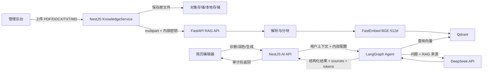

# ResumeSystem 真实 RAG 工程说明

版本：2026-07-11
状态：本地 Docker 环境端到端验证通过

## 1. 目标与边界

本工程把“后台上传标准文档—真实向量化—向量数据库检索—真实 LLM 生成—来源回传”串成一条可审计链路。Embedding 不调用 mock 或哈希近似；LLM 不使用固定模板冒充生成。知识库只为模型提供检索依据，模型不得把知识库中的外部内容当成候选人的个人事实。

当前实现选择：

- Embedding：FastEmbed `BAAI/bge-small-zh-v1.5`，512 维真实稠密向量。
- Vector DB：Qdrant，collection `resume_knowledge_bge_zh_v1_5`。
- Agent：FastAPI + LangGraph，包含感知、检索、分析、规划、生成和校验节点。
- LLM：DeepSeek OpenAI-compatible Chat Completions，模型 `deepseek-v4-pro`。
- 主业务：NestJS 负责鉴权、后台知识库、AI 配置、额度、审计和用户 API。
- 管理端：Vue 后台提供文档上传、重建索引、启停、删除和检索测试。

DeepSeek 官方目前没有公开 Embeddings API，因此本工程没有伪造一个 DeepSeek Embedding 接口，而是使用可在本地真实执行的 BGE 模型。DeepSeek 仅承担生成与推理。

## 2. 运行架构



信任边界：浏览器永远不直接获得 LLM API key 或 Agent 内部密钥；NestJS 与 Agent 之间使用 `X-Agent-Secret`；Agent 仅接受内部鉴权请求；知识库文本在 LLM prompt 中被明确标记为“不可信参考资料”。

## 3. 文档上传与索引流程

入口为 `POST /api/admin/knowledge-documents/upload`，要求管理员 JWT。支持 PDF、DOCX、TXT、Markdown，后台上传上限 20 MB；Agent 侧再次限制为 10 MB，形成纵深校验。

处理顺序：

1. NestJS 保存原文件并创建 `knowledge_documents` 记录，状态设为 `indexing`。
2. `KnowledgeAgentClientService` 通过内部网络把文件、文档 ID、名称和分类发送到 `/rag/index`。
3. Agent 根据类型抽取文本：PDF 使用 PDF 文本解析，DOCX 读取段落，纯文本按 UTF-8 解析。
4. 文本按段落和长度切分为稳定 chunk，每个 chunk 保留 `documentId`、`documentName`、`category` 和 `chunkIndex`。
5. FastEmbed 加载 BGE 中文模型并生成 512 维向量。
6. Agent 检查 Qdrant collection 的向量维度；若旧 collection 维度不同则显式失败，不进行静默混写。
7. Qdrant upsert 完成后返回 chunk 数；NestJS 把记录更新为 `ready`。失败则记录 `failed` 与经过截断的错误信息。

删除、禁用和重建索引均同步操作 Qdrant。Embedding 模型文件保存在 Docker 命名卷 `fastembed_models`，容器重建后无需重复下载。

## 4. 检索与 Agent 流程

用户调用 `/api/ai/diagnose`、`/api/ai/polish` 或 `/api/ai/generate` 后：

1. NestJS 校验 cuser JWT、AI 开关和额度。
2. 当 `executionEngine=agent` 时，把用户 ID、目标岗位、模块、简历正文与任务要求发送给 Agent。
3. Agent 用目标岗位、模块、正文和用户要求构造检索 query，最大截断到 3000 字符。
4. FastEmbed 对 query 生成同模型向量，在 Qdrant 做 cosine 稠密召回；同时对候选语料执行中英文词法 BM25 召回。
5. 融合重排使用 Dense 0.68、Lexical 0.27、查询词覆盖率 0.05 的默认权重，返回 `denseScore`、`lexicalScore` 和 `retrievalMethod=hybrid-dense-bm25`，便于审计与调参。
6. 检索结果以 `sourceId/documentId/documentName/category/excerpt/score` 进入 prompt，同时最终响应原样返回 `sources`，支持 UI 引用和审计。
7. DeepSeek 以 JSON object response format 返回诊断、策略、建议、patch 和 warnings。
8. Agent 的校验节点检查建议是否引入原简历不存在的数字，并将可疑数字列入 warning。
9. NestJS 只在审计记录中保存必要的输入摘要与输出摘要，不记录 API key。

生产环境默认启用 `RAG_STRICT_SOURCES=true`：Qdrant 不可用或没有达到阈值的来源时，Agent fail-closed 并阻止 LLM 无依据生成。开发环境可关闭该开关，关闭后会在 retrieval step 中显式返回 warning 并继续基础流程。

## 5. LLM 配置

管理员在系统配置中设置：

```text
enabled=true
executionEngine=agent
agentBaseUrl=http://agent:8000
provider=deepseek
apiBaseUrl=https://api.deepseek.com
apiModel=deepseek-v4-pro
temperature=0.3
```

API key 只能通过管理后台或运行时环境变量注入，不得写入 Git、脚本默认值、Dockerfile、日志或本文档。系统配置公共读取接口只返回 `apiKeyConfigured`，不会回传明文密钥。NestJS 在内部 Agent 请求中临时透传密钥；Agent 不持久化它。

Agent 为 DeepSeek V4 请求启用 thinking 与 high reasoning effort，并要求 JSON object。`LLM_TIMEOUT_SECONDS` 默认 120 秒，NestJS 的 `AGENT_REQUEST_TIMEOUT_MS` 默认 150 秒，外层超时必须大于内层，避免 DeepSeek 尚在生成时被主业务提前中止。

## 6. 分页与 PDF 策略

### 6.1 一页适配下限

编辑器的一页适配只调整密度，不删除内容。下限固定为：正文 12px、行高 1.4、模块间距 12px、条目间距 8px。达到下限仍超页时停止压缩，并向用户报告估算页数；不以不可读的小字换取“一页简历”的表面结果。

### 6.2 自然分页

`.resume-section`、`.timeline-section`、`.student-section` 等模块容器允许 `break-inside:auto`。因此一个很长的工作经历模块可以自然进入下一页，不会留下大片空白。

### 6.3 标题孤行

模块标题、条目标题和卡片头使用 `break-after:avoid`，浏览器会尽量把标题与后续内容放在同一页。正文设置 `orphans:2` 与 `widows:2`，降低段首或段尾仅一行落在单独页面的概率。

### 6.4 条目跨页

单个 `.section-item`、时间线卡片、学生模板条目和其他模板的 article 使用 `break-inside:avoid`。分页发生在条目之间，而不是把同一段项目/经历从中间撕开。模块容器与条目采用不同规则，这是自然分页与条目完整性能够同时成立的关键。

### 6.5 PDF 页数断言

Puppeteer 生成 PDF 后，后端用 `pdf-parse` 读取成品并断言 `numpages >= 1`。API 返回：

```json
{
  "url": "/uploads/exports/user-1/resume-xxx.pdf",
  "pageCount": 2
}
```

前端导出完成后显示实际页数。`scripts/pagination-pdf-qa.js` 构造足够长的简历，断言页数至少为 2；`scripts/product-flow-qa.js` 对日常编辑器导出断言页数至少为 1。

## 7. 关键 API

| API | 权限 | 用途 |
|---|---|---|
| `POST /api/admin/knowledge-documents/upload` | admin | 上传并索引文档 |
| `GET /api/admin/knowledge-documents` | admin | 分页查询文档与索引状态 |
| `POST /api/admin/knowledge-documents/:id/reindex` | admin | 重新解析与向量化 |
| `PUT /api/admin/knowledge-documents/:id/enabled` | admin | 同步启停数据库与向量记录 |
| `DELETE /api/admin/knowledge-documents/:id` | admin | 删除原文件、记录与向量 |
| `POST /api/admin/knowledge-documents/search` | admin | 检索质量测试 |
| `POST /api/ai/diagnose` | cuser | RAG 简历诊断 |
| `POST /api/ai/polish` | cuser | RAG 文本润色 |
| `POST /api/ai/generate` | cuser | RAG 内容生成 |
| `POST /api/resumes/export` | cuser | 生成 PDF 并返回真实页数 |

Agent 内部 API：`/rag/index`、`/rag/search`、`/rag/documents/:id`、`/agent/diagnose`、`/agent/polish`、`/agent/generate`；均应只暴露在容器内部网络并要求内部密钥。

## 8. 运行与验证

启动真实 RAG：

```powershell
docker compose -f docker-compose.prod.yml up -d --build backend web admin agent qdrant
```

首次预热 Embedding：

```powershell
docker exec resume-agent python -c "from app.rag import embed_texts; print(len(embed_texts(['简历知识库'])[0]))"
```

完整 RAG 回归（密钥只在当前进程环境中存在）：

```powershell
$env:QA_LLM_API_KEY='<test-key>'
node backed-resume/scripts/real-rag-e2e.js
Remove-Item Env:QA_LLM_API_KEY
```

分页 PDF 回归：

```powershell
node backed-resume/scripts/pagination-pdf-qa.js
```

本轮实测结果：BGE 输出 512 维向量；标准知识库状态 ready、2 chunks；Hybrid 检索 2 hits、Top score 0.758584（Dense 0.675614、Lexical 1.0）；DeepSeek live 调用模型为 `deepseek-v4-pro`、tokenUsed 2357；Agent 返回 2 条来源；严格来源无命中请求被结构化阻断；构造的多页 PDF 实际为 2 页。

## 9. 运维与故障排查

- Agent health 为 degraded：先检查 Qdrant 网络、collection 和内部密钥，不要直接切换 hash。
- 向量维度冲突：修改 Embedding 模型时必须使用新 collection 名或执行明确迁移，禁止在旧 collection 混写。
- 首次索引慢：检查 `fastembed_models` 卷；首次模型下载后应持久化。
- 文档 `failed`：在后台查看 errorMessage，修正文档后点重建索引。
- 检索无命中：分别检查 enabled、category、最低分数阈值、chunk 内容和 query；先调用后台 search API 隔离 LLM 因素。
- LLM 401/402/429：分别检查密钥、余额/权限、速率限制；不得自动回落为 mock 并宣称成功。
- LLM 超时：确保 NestJS 外层超时大于 Agent 内层超时，必要时降低输入长度或模型推理强度。
- PDF 503：确认容器中的 `PUPPETEER_EXECUTABLE_PATH=/usr/bin/chromium-headless-shell` 与镜像安装内容一致。
- PDF 页数异常：保存原始 HTML 与 PDF，检查 `@page`、A4 宽度、字体加载、超长不可拆元素和图片尺寸。

## 10. 已知限制与下一步

- 当前已使用 Dense + BM25 融合和轻量重排；更大规模知识库可继续增加独立稀疏向量索引与 Cross-Encoder reranker。
- 目前 chunk 策略以段落与长度为主，可进一步加入 Markdown 标题层级和表格感知切分。
- 严格来源模式已作为生产默认值；后续可在管理后台增加按任务类型配置。
- DeepSeek V4 的长上下文能力不意味着每次都应发送全部简历与全部知识库；检索仍应控制来源数量和 token 成本。
- PDF CSS 的 `avoid` 是浏览器分页提示；如果单个条目本身高于一整页，浏览器仍必须拆分。UI 应提示用户拆分超长条目。

## 11. 相关文件

- `python-agent/app/rag.py`：解析、切分、Embedding、Qdrant。
- `python-agent/app/graph.py`：Agent 节点与 RAG/LLM 编排。
- `python-agent/app/llm.py`：DeepSeek OpenAI-compatible 调用与结构化输出。
- `backed-resume/modules/knowledge/`：知识库业务与内部 Agent 客户端。
- `backed-resume/modules/ai/ai-agent-client.service.ts`：用户请求到 Agent 的桥接。
- `backed-resume/modules/resumes/resumes.service.ts`：打印 CSS、PDF 生成与页数解析。
- `fronted-resume-web/src/views/CoreResumeEditor.vue`：一页适配下限与导出页数反馈。
- `docs/knowledge-base/resume-writing-standard-v1.md`：本轮上传并验证的标准知识库。
- `backed-resume/scripts/real-rag-e2e.js`：真实 RAG 端到端门禁。
- `backed-resume/scripts/pagination-pdf-qa.js`：多页 PDF 门禁。
