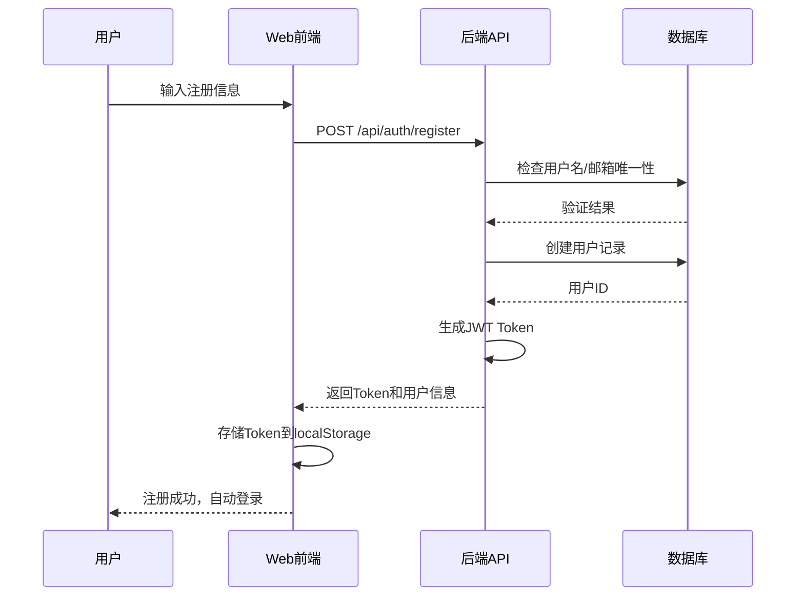
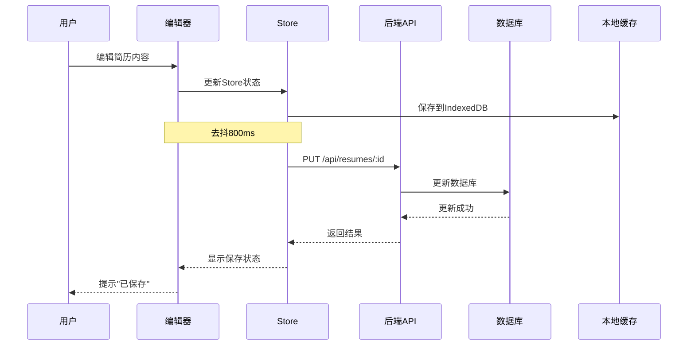
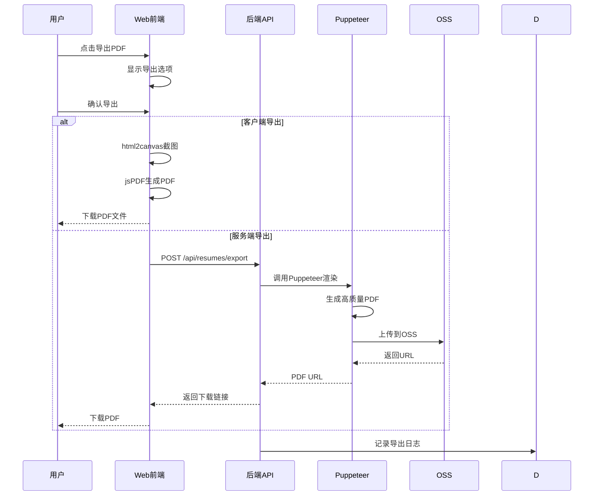
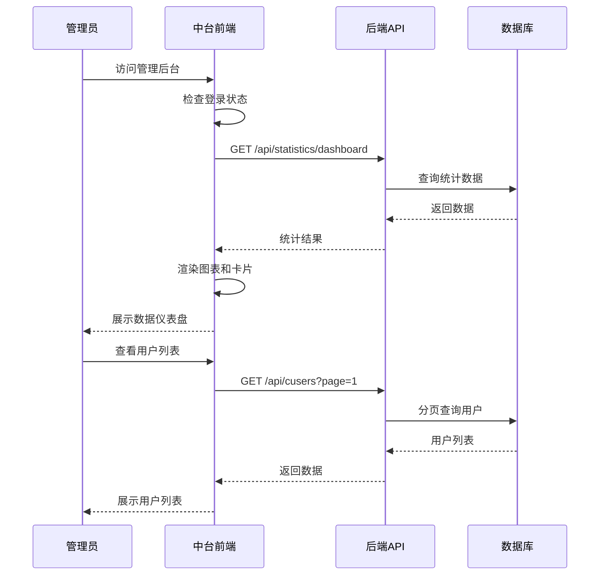

# 简历平台系统架构与需求总览

## 文档信息

| 项目     | 内容               |
| -------- | ------------------ |
| 文档版本 | v1.0               |
| 创建日期 | 2026-01-12         |
| 项目名称 | 跨端简历项目       |
| 文档类型 | 系统架构与需求总览 |

---

## 一、系统概述

### 1.1 项目背景

本项目旨在构建一个完整的在线简历制作与管理平台，为 C 端用户提供便捷的简历编辑体验，同时为平台运营方提供强大的管理和数据分析能力。

### 1.2 系统架构

```
┌─────────────────────────────────────────────────────────────┐
│                        用户层                                 │
├─────────────────┬───────────────────┬───────────────────────┤
│  C端Web用户      │   移动端用户       │   中台管理员          │
│  (求职者)        │   (iOS/Android)   │   (运营/管理)         │
└────────┬────────┴─────────┬─────────┴──────────┬────────────┘
         │                  │                    │
         ▼                  ▼                    ▼
┌─────────────────┐ ┌─────────────────┐ ┌──────────────────┐
│ fronted-resume- │ │ fronted-resume- │ │ middle-resume    │
│ web (Web前端)   │ │ uni (跨端前端)   │ │ (中台前端)        │
│                 │ │                 │ │                  │
│ Vue 3 + Vite   │ │ uni-app         │ │ Vue 3 + ECharts  │
└────────┬────────┘ └────────┬────────┘ └─────────┬────────┘
         │                   │                    │
         └───────────────────┴────────────────────┘
                            │
                            ▼
                  ┌──────────────────┐
                  │  backed-resume   │
                  │  (后端API服务)     │
                  │                  │
                  │  NestJS + MySQL  │
                  └─────────┬────────┘
                            │
                ┌───────────┴──────────┐
                ▼                      ▼
        ┌───────────────┐      ┌─────────────┐
        │  MySQL数据库   │      │ 第三方服务   │
        │  (数据存储)    │      │ (AI/OSS等)  │
        └───────────────┘      └─────────────┘
```

### 1.3 子系统说明

| 子系统                 | 名称             | 技术栈                    | 说明                                 |
| ---------------------- | ---------------- | ------------------------- | ------------------------------------ |
| **fronted-resume-web** | C 端简历编辑系统 | Vue 3 + TS + Vite         | 主要产品，面向 C 端用户的 Web 编辑器 |
| **middle-resume**      | 简历中台管理系统 | Vue 3 + TS + Element Plus | 运营管理后台，管理用户、模板和数据   |
| **backed-resume**      | 后端 API 服务    | NestJS + MySQL + TypeORM  | 提供统一的 API 服务                  |
| **fronted-resume-uni** | 跨端移动应用     | uni-app                   | 移动端应用（可选）                   |

---

## 二、各系统功能清单

### 2.1 C 端简历编辑系统 (fronted-resume-web)

**核心功能**:

1. **用户认证**

   - 注册/登录（手机/邮箱/第三方）
   - 个人中心管理

2. **模板管理**

   - 模板浏览与筛选
   - 模板预览
   - 模板切换

3. **简历编辑**

   - 所见即所得编辑器
   - 10+种简历模块（基础信息、教育、工作、项目等）
   - 富文本编辑
   - 实时预览
   - 自动保存

4. **AI 辅助**

   - AI 内容生成
   - AI 内容优化
   - AI 智能匹配

5. **简历管理**

   - 简历列表
   - 版本管理
   - 简历复制

6. **导出与分享**
   - PDF 导出（高质量）
   - 图片导出
   - 在线分享
   - 直接打印

**详细需求**: 见 `fronted-resume-web/需求文档-C端简历编辑系统.md`

---

### 2.2 简历中台管理系统 (middle-resume)

**核心功能**:

1. **认证与权限**

   - 管理员登录
   - RBAC 权限控制（admin/operator/viewer）
   - 操作审计

2. **数据统计仪表盘**

   - 核心数据概览
   - 趋势图表分析
   - 用户行为分析
   - 数据导出

3. **C 端用户管理**

   - 用户列表与搜索
   - 用户详情查看
   - 用户状态管理（启用/禁用）
   - 用户删除与恢复

4. **管理员管理**

   - 管理员 CRUD
   - 角色分配
   - 权限管理

5. **模板管理**

   - 模板 CRUD
   - 模板预览
   - 模板审核（UGC 场景）
   - 模板统计

6. **AI 操作监控**

   - AI 操作记录查看
   - Token 消耗统计
   - 成本分析
   - 异常监控

7. **系统配置**
   - 基础参数配置
   - 日志查询
   - 系统监控

**详细需求**: 见 `middle-resume/需求文档-简历中台管理系统.md`

---

### 2.3 后端 API 服务 (backed-resume)

**核心功能**:

1. **认证服务**

   - JWT Token 生成与验证
   - 用户注册与登录
   - Token 刷新

2. **用户服务**

   - C 端用户 CRUD
   - 管理员用户 CRUD
   - 用户状态管理

3. **模板服务**

   - 模板 CRUD
   - 模板搜索与筛选
   - 模板统计

4. **简历服务**

   - 简历 CRUD
   - 简历版本管理
   - 简历导出（PDF/图片）
   - 简历分享

5. **AI 服务**

   - AI 内容生成
   - AI 内容优化
   - AI 使用记录

6. **统计服务**
   - 数据统计
   - 报表生成

**技术栈**:

- 框架: NestJS
- 数据库: MySQL + TypeORM
- 缓存: Redis（可选）
- 文件存储: 阿里云 OSS/本地存储

**详细设计**: 见 `backed-resume/《简历中台系统 API 接口及数据库表结构设计》.md`

---

## 三、技术架构

### 3.1 前端技术栈对比

| 技术      | fronted-resume-web | middle-resume  | fronted-resume-uni |
| --------- | ------------------ | -------------- | ------------------ |
| **框架**  | Vue 3              | Vue 3          | uni-app (Vue 3)    |
| **构建**  | Vite               | Vite           | Vite               |
| **语言**  | TypeScript         | TypeScript     | TypeScript         |
| **UI 库** | Element Plus       | Element Plus   | uni-ui             |
| **状态**  | Pinia              | Pinia          | Pinia              |
| **路由**  | Vue Router         | Vue Router     | uni 路由           |
| **图表**  | -                  | ECharts        | uCharts            |
| **特色**  | 编辑器、导出       | 数据统计、管理 | 跨端适配           |

### 3.2 后端技术栈

| 技术       | 版本        | 说明                |
| ---------- | ----------- | ------------------- |
| **框架**   | NestJS 10.x | 企业级 Node.js 框架 |
| **语言**   | TypeScript  | 类型安全            |
| **ORM**    | TypeORM     | 数据库操作          |
| **数据库** | MySQL 8.0+  | 关系型数据库        |
| **认证**   | JWT         | Token 认证          |
| **文档**   | Swagger     | API 文档            |
| **日志**   | Winston     | 日志记录            |
| **缓存**   | Redis       | 可选，提升性能      |

### 3.3 数据库设计

**核心表**:
| 表名 | 说明 | 主要字段 |
|-----|------|---------|
| `admin_users` | 管理员用户 | id, username, password, userType, status |
| `c_users` | C 端用户 | id, username, email, phone, status, aiOperationCount |
| `templates` | 简历模板 | id, templateName, templateData, previewImage, useCount |
| `resumes` | 简历数据 | id, userId, templateId, title, content, status |
| `ai_operations` | AI 操作记录 | id, userId, operationType, inputData, outputData, tokenUsed |
| `statistics` | 统计数据 | id, type, date, count, value |
| `resume_downloads` | 简历下载记录 | id, resumeId, userId, format, time |
| `template_usage` | 模板使用记录 | id, templateId, userId, time |

**详细设计**: 见数据库设计文档

---

## 四、系统交互流程

### 4.1 用户注册与登录



### 4.2 简历编辑与保存



### 4.3 简历导出流程



### 4.4 中台管理流程



---

## 五、核心业务流程

### 5.1 C 端用户使用流程

```
1. 注册/登录
   ↓
2. 浏览模板库
   ↓
3. 选择模板
   ↓
4. 填写基本信息
   ↓
5. 添加各类模块（教育、工作、项目等）
   ↓
6. 使用AI优化内容（可选）
   ↓
7. 调整样式和布局
   ↓
8. 预览效果
   ↓
9. 导出PDF
   ↓
10. 分享或投递简历
```

### 5.2 模板管理流程

```
1. 运营创建模板
   ↓
2. 上传模板JSON配置
   ↓
3. 系统验证格式
   ↓
4. 自动生成预览图
   ↓
5. 模板审核（如需要）
   ↓
6. 启用模板
   ↓
7. C端用户可见
   ↓
8. 统计使用数据
```

### 5.3 AI 辅助流程

```
1. 用户输入关键信息
   ↓
2. 前端调用AI接口
   ↓
3. 后端转发到AI服务
   ↓
4. AI生成/优化内容
   ↓
5. 返回结果给前端
   ↓
6. 用户确认或修改
   ↓
7. 记录AI操作日志
   ↓
8. 统计Token消耗
```

---

## 六、接口设计规范

### 6.1 RESTful API 规范

**基础路径**: `https://api.resume.example.com`

**请求格式**:

```http
POST /api/resumes HTTP/1.1
Host: api.resume.example.com
Content-Type: application/json
Authorization: Bearer {token}

{
  "title": "我的简历",
  "templateId": "1",
  "content": { ... }
}
```

**响应格式**:

```json
{
  "code": 200,
  "message": "Success",
  "data": {
    "id": 123,
    "title": "我的简历"
  }
}
```

### 6.2 错误码规范

| 错误码 | HTTP 状态 | 说明                |
| ------ | --------- | ------------------- |
| 200    | 200       | 成功                |
| 400    | 400       | 请求参数错误        |
| 401    | 401       | 未登录或 Token 过期 |
| 403    | 403       | 无权限访问          |
| 404    | 404       | 资源不存在          |
| 500    | 500       | 服务器错误          |
| 1001   | 400       | 用户名或密码错误    |
| 1002   | 400       | 验证码错误          |
| 2001   | 404       | 简历不存在          |
| 2002   | 404       | 模板不存在          |
| 3001   | 500       | AI 服务调用失败     |

### 6.3 分页规范

**请求参数**:

```typescript
interface PaginationQuery {
  page: number; // 页码，从1开始
  limit: number; // 每页数量，默认10
}
```

**响应格式**:

```typescript
interface PageResult<T> {
  list: T[]; // 数据列表
  total: number; // 总记录数
  page: number; // 当前页码
  limit: number; // 每页数量
}
```

---

## 七、部署架构

### 7.1 生产环境架构

```
                        ┌─────────────┐
                        │   用户端    │
                        └──────┬──────┘
                               │
                    ┌──────────┴──────────┐
                    │                     │
            ┌───────▼────────┐   ┌───────▼────────┐
            │  CDN (静态资源) │   │  Nginx (负载)  │
            └────────────────┘   └───────┬────────┘
                                         │
                            ┌────────────┼────────────┐
                            │            │            │
                    ┌───────▼────┐ ┌────▼─────┐ ┌───▼──────┐
                    │ Web前端     │ │ 中台前端  │ │ 移动端   │
                    │ (Nginx)    │ │ (Nginx)  │ │ (CDN)    │
                    └────────────┘ └──────────┘ └──────────┘
                            │            │            │
                            └────────────┼────────────┘
                                        │
                                 ┌──────▼───────┐
                                 │  API Gateway │
                                 │  (Nginx/Kong)│
                                 └──────┬───────┘
                                        │
                            ┌───────────┼───────────┐
                            │           │           │
                    ┌───────▼────┐ ┌───▼────┐ ┌───▼────┐
                    │ 后端服务1   │ │ 服务2  │ │ 服务3  │
                    │ (NestJS)   │ │ ...    │ │ ...    │
                    └───────┬────┘ └───┬────┘ └───┬────┘
                            │          │          │
                            └──────────┼──────────┘
                                      │
                        ┌─────────────┼─────────────┐
                        │             │             │
                ┌───────▼────┐ ┌─────▼──────┐ ┌───▼─────┐
                │  MySQL     │ │  Redis     │ │  OSS    │
                │  (主从)    │ │  (缓存)    │ │ (存储)  │
                └────────────┘ └────────────┘ └─────────┘
```

### 7.2 服务器配置建议

#### 7.2.1 前端服务器

- **CPU**: 2 核
- **内存**: 4GB
- **硬盘**: 50GB SSD
- **带宽**: 5M
- **数量**: 2 台（主备）

#### 7.2.2 后端服务器

- **CPU**: 4 核
- **内存**: 8GB
- **硬盘**: 100GB SSD
- **带宽**: 10M
- **数量**: 2 台起（可横向扩展）

#### 7.2.3 数据库服务器

- **CPU**: 8 核
- **内存**: 16GB
- **硬盘**: 500GB SSD（主从复制）
- **备份**: 每日全量+增量

---

## 八、安全策略

### 8.1 认证安全

1. **密码策略**

   - BCrypt 加密存储
   - 8-20 位，包含字母数字
   - 定期强制修改

2. **Token 机制**

   - JWT Token
   - 24 小时过期
   - 支持刷新 Token
   - Redis 黑名单

3. **防暴力破解**
   - 5 次失败锁定 30 分钟
   - IP 限流
   - 图形验证码

### 8.2 数据安全

1. **传输安全**

   - 全站 HTTPS
   - TLS 1.2+
   - HSTS 启用

2. **存储安全**

   - 敏感信息加密
   - 数据库备份
   - 软删除策略

3. **访问控制**
   - RBAC 权限控制
   - API 鉴权
   - 跨域限制

### 8.3 应用安全

1. **XSS 防护**

   - 输入验证
   - 输出转义
   - CSP 策略

2. **CSRF 防护**

   - Token 验证
   - SameSite Cookie

3. **SQL 注入防护**
   - ORM 使用
   - 参数化查询

---

## 九、监控与运维

### 9.1 监控指标

#### 9.1.1 前端监控

- **性能指标**: LCP, FID, CLS
- **错误监控**: Sentry
- **用户行为**: 埋点统计
- **接口监控**: API 调用成功率

#### 9.1.2 后端监控

- **系统指标**: CPU、内存、磁盘
- **服务指标**: QPS、响应时间、错误率
- **数据库**: 连接数、慢查询
- **业务指标**: 注册数、活跃数、导出数

### 9.2 日志管理

1. **日志分类**

   - 访问日志（Nginx）
   - 应用日志（NestJS）
   - 错误日志
   - 审计日志

2. **日志存储**
   - 本地文件（7 天）
   - ELK Stack（长期）
   - 分级存储

### 9.3 告警机制

- **监控告警**: 服务异常、性能下降
- **业务告警**: 注册异常、导出失败
- **安全告警**: 异常登录、攻击检测
- **通知方式**: 邮件、短信、钉钉

---

## 十、项目实施计划

### 10.1 开发阶段（9 周）

| 阶段       | 周期     | 主要工作             | 交付物                  |
| ---------- | -------- | -------------------- | ----------------------- |
| **阶段一** | Week 1-4 | C 端系统基础功能开发 | 认证、模板、编辑器核心  |
| **阶段二** | Week 5-7 | C 端系统高级功能     | AI 辅助、导出、版本管理 |
| **阶段三** | Week 8-9 | 中台系统开发         | 管理后台全部功能        |

### 10.2 测试阶段（2 周）

| 测试类型 | 时间    | 负责人   |
| -------- | ------- | -------- |
| 单元测试 | Week 10 | 开发团队 |
| 集成测试 | Week 10 | 测试团队 |
| 性能测试 | Week 11 | 测试团队 |
| 安全测试 | Week 11 | 安全团队 |
| UAT 测试 | Week 11 | 产品团队 |

### 10.3 上线阶段（1 周）

- Week 12: 部署、灰度发布、监控配置、文档整理

---

## 十一、附录

### 11.1 相关文档索引

| 文档名称     | 路径                                                         | 说明             |
| ------------ | ------------------------------------------------------------ | ---------------- |
| C 端需求文档 | fronted-resume-web/需求文档-C 端简历编辑系统.md              | Web 前端详细需求 |
| 中台需求文档 | middle-resume/需求文档-简历中台管理系统.md                   | 管理后台详细需求 |
| 后端接口文档 | backed-resume/《简历中台系统 API 接口及数据库表结构设计》.md | API 和数据库设计 |
| 渲染引擎文档 | fronted-resume-web/RENDER_ENGINE_FIX.md                      | 渲染引擎技术文档 |
| 使用指南     | fronted-resume-web/渲染引擎使用指南.md                       | 系统使用手册     |

### 11.2 技术参考

| 技术         | 官方文档                    |
| ------------ | --------------------------- |
| Vue 3        | https://vuejs.org/          |
| NestJS       | https://nestjs.com/         |
| Element Plus | https://element-plus.org/   |
| TypeORM      | https://typeorm.io/         |
| ECharts      | https://echarts.apache.org/ |

### 11.3 联系方式

| 角色       | 姓名 | 邮箱 |
| ---------- | ---- | ---- |
| 项目负责人 | -    | -    |
| 技术负责人 | -    | -    |
| 产品负责人 | -    | -    |

---

**文档结束**

_本文档持续更新，最后更新时间：2026-01-12_
